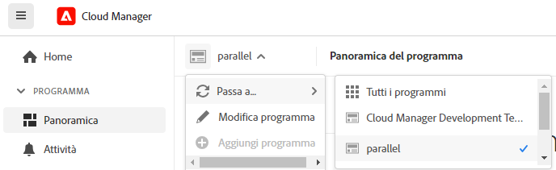
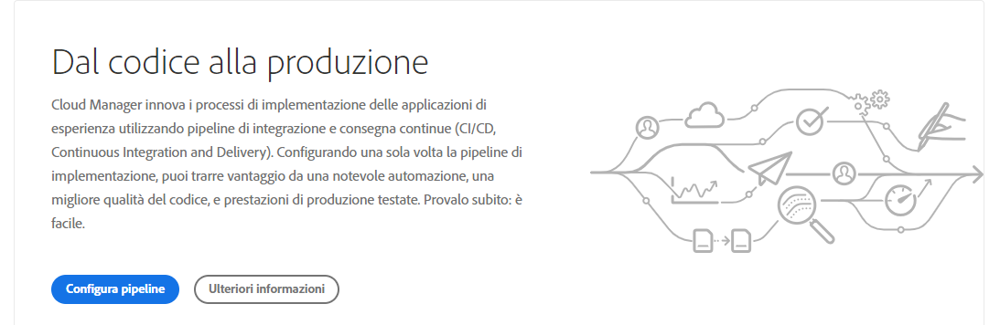

# Navigare nell’interfaccia utente di Cloud Manager {#navigation}

Scopri come è organizzata l’interfaccia utente di Cloud Manager e come spostarsi per gestire i programmi e gli ambienti.

L’interfaccia utente di Cloud Manager è composta principalmente da due interfacce grafiche:

* [La console Programmi personali](#my-programs-console) è la posizione da cui visualizzare e gestire tutti i programmi.
* [La finestra Panoramica del programma](#program-overview) è dove puoi visualizzare i dettagli e gestire un singolo programma.

## Console Programmi personali {#my-programs-console}

Quando si accede a Cloud Manager all&#39;indirizzo [experience.adobe.com](https://experience.adobe.com/experiencemanager) e si seleziona l&#39;organizzazione appropriata, si accede alla console **Programmi personali**.

La console **Programmi personali** fornisce una panoramica di tutti i programmi a cui si ha accesso nell&#39;organizzazione selezionata. È costituita da diverse elementi.

|   | Area | Descrizione |
| --- | --- | --- |
| 1 | [Barre degli strumenti](#toolbars-my-programs-toolbars) | Utilizza per la selezione dell’organizzazione, gli avvisi e le impostazioni dell’account. |
| 2 | Scheda del pannello laterale sinistro | Varie schede che consentono di attivare/disattivare la visualizzazione corrente dei programmi, tra cui: <ul><li>**Experience Manager** apre la home page delle varie soluzioni AEM</li><li>**Tutti i programmi** che visualizza tutti i programmi disponibili.</li><li>**License** apre la dashboard delle licenze. La Dashboard delle licenze si applica solo ai *programmi AEM as a Cloud Service* (AEMaaCS) e non ai programmi Adobe Managed Services come AEM 6.5 e AEM 6.5 LTS. Per determinare il tipo di servizio del programma (AEMaaCS o AMS), consulta la [sezione Schede del programma](#program-cards) di questo articolo. Per impostazione predefinita, le schede sono chiuse e possono essere visualizzate utilizzando l&#39;icona del menu , disponibile sul lato sinistro dell&#39;[intestazione Cloud Manager](#cloud-manager-header).</li></ol> |
| 3 | [I miei programmi](#my-programs-section) | Elenca tutti i programmi disponibili selezionabili. Per informazioni dettagliate sui programmi, vedere [Programmi e tipi di programmi](/help/getting-started/program-setup.md). |
| 4 | [Inviti all&#39;azione e statistiche](#cta-statistics) | Offre una panoramica delle attività recenti. |
| 5 | [Collegamenti rapidi](#quick-links) | Accesso rapido alle risorse correlate. |

### Barre degli strumenti {#my-programs-toolbars}

Sono disponibili due barre degli strumenti una sopra l’altra.

#### Intestazione di Cloud Manager {#cloud-manager-header}

La prima è l’intestazione Cloud Manager. L’intestazione diventa persistente durante la navigazione in Cloud Manager. Si tratta di un ancoraggio che consente di accedere alle impostazioni e alle informazioni applicabili ai diversi programmi di Cloud Manager.

| Area | Descrizione |
| --- | --- |
|  | Menu a discesa che consente di accedere alle schede per parti specifiche di un singolo programma. Per determinare il tipo di servizio di cui dispone il programma (AMS o AEMaaCS), consulta la [sezione Schede del programma](#program-cards) di questo documento. |
|  Cloud Manager | Fare clic per aprire la console **I miei programmi** di Cloud Manager, indipendentemente dalla posizione in cui ci si trova in Cloud Manager. |
| *`Name of selected organization`* | Il selettore organizzazione visualizza l&#39;organizzazione a cui si è attualmente connessi (in questo esempio, *Foundation Internal*). Fai clic su per passare a un’altra organizzazione se l’Adobe ID è associata a più organizzazioni. |
|  Feedback | Fai clic su per fornire ad Adobe un feedback su Cloud Manager. |
|  | L’Assistente per l’intelligenza artificiale offre un’interfaccia di conversazione progettata per semplificare la ricerca delle risposte alle query relative ad AEM. Vedi [Assistente IA](https://experienceleague.adobe.com/en/docs/experience-manager-65/content/ai-assistant/ai-assistant-in-aem) |
|  | Fai clic su per fornire un accesso rapido alle risorse di apprendimento e supporto. |
|  | Fai clic per visualizzare il numero di [notifiche](/help/using/notifications.md) incomplete attualmente assegnate |
|  | Fai clic per passare rapidamente dalla pagina Home di AEM alle soluzioni AEM |
| *`Dynamic Account icon`* | Fai clic sull&#39;immagine utente per accedere alle **Impostazioni account** e **Impostazioni programma** oppure per uscire. Se si è scelto di non aggiungere un&#39;immagine utente, verrà assegnata un&#39;icona in modo casuale, come illustrato nell&#39;immagine della barra degli strumenti precedente. |

<!--
1. The  icon on the left side of the header is  
   * The License Dashboard only applies to AEM as a Cloud Service programs, not AMS programs.
   * To determine the type of service your program has (AMS or AEMaaCS), see the [Program Cards section](#program-cards) of this document.
1. The **Adobe Cloud Manager** button takes you back to the **My Programs** console of Cloud Manager no matter where you are in Cloud Manager.
1. Click **Feedback** to provide feedback to Adobe about Cloud Manager.
1. The organization selector displays the organization that you are currently signed into (in this example, Foundation Internal). Click to switch to another organization if your Adobe ID is associated with multiple.
1. Clicking the solutions switcher lets you quickly jump to other Experience Cloud solutions.
1. The Help icon provides quick access to learning and support resources.
1. The notifications icon is badged with the number of currently assigned incomplete [notifications](/help/using/notifications.md)
1. Select the icon representing your user to access your user settings. If you do not select a user picture, an icon is randomly assigned. -->

#### Barra degli strumenti del programma {#program-toolbar}

La barra degli strumenti del programma fornisce collegamenti per passare da programmi ad azioni di Cloud Manager e viceversa appropriati al contesto.

|   | Area | Descrizione |
| --- | --- | --- |
| 1 | Programmi personali | Fai clic su per aprire un elenco a discesa in cui puoi scegliere di aggiungere un programma, selezionare altri programmi esistenti o tornare alla pagina Home di Experience Manager. |
| 2 |  Guida introduttiva | Fai clic su per accedere al [percorso di documentazione sull&#39;onboarding](https://experienceleague.adobe.com/it/docs/experience-manager-cloud-service/content/onboarding/journey/overview) per iniziare a utilizzare Cloud Manager. Il percorso di onboarding è progettato per Cloud Manager su Adobe Experience Manager as a Cloud Service (AEMaaCS) e non per Cloud Manager su Adobe Managed Services (AMS). Tuttavia, molti concetti sono gli stessi. |
| 3 | *`Dynamic action button`* | Il pulsante di azione offre azioni appropriate al contesto su cui è possibile fare clic, ad esempio **Aggiungi programma** (illustrato nell&#39;esempio precedente) o aggiungi un dominio. |

### Invito all’azione e statistiche {#cta-statistics}

La sezione Invito all’azione e statistiche fornisce dati aggregati per l’organizzazione. Ad esempio, se i programmi sono stati configurati correttamente, è possibile che vengano visualizzate le statistiche delle attività degli ultimi 90 giorni, tra cui:

* Numero di [implementazioni](/help/using/code-deployment.md)
* Numero di [problemi di qualità del codice](/help/using/code-quality-testing.md) identificati
* Numero di build

Oppure, se stai iniziando la configurazione dell’organizzazione, potrebbero essere disponibili suggerimenti sui passaggi successivi o sulle risorse della documentazione.

### Programmi personali {#my-programs-section}

Il contenuto principale della console Programmi personali è la sezione **Programmi personali** in cui i programmi sono elencati come singole schede. Fai clic su una scheda per accedere alla pagina **Panoramica del programma** per informazioni dettagliate sul programma.

A seconda dei privilegi di cui disponi, potrebbe non essere possibile selezionare alcuni programmi.

Per trovare rapidamente il programma desiderato, è possibile utilizzare le seguenti opzioni di ordinamento:

* Ordina per:
   * Data di creazione
   * Nome del programma
   * Stato
*  /  Ordinamento dei programmi rispettivamente decrescente o decrescente.
*  /  Visualizza programmi rispettivamente in forma griglia o elenco.

#### Schede del programma {#program-cards}

Una scheda o riga in una tabella rappresenta ogni programma, fornendo una panoramica del programma e collegamenti rapidi per intraprendere azioni.

* Immagine del programma (se configurata)
* Nome del programma (nell&#39;esempio precedente, *WKND Magazine*)
* Tipo di servizio:
   * **Experience Manager** per i programmi AMS
   * **Experience Manager Cloud** per [programmi AEM as a Cloud Service](https://experienceleague.adobe.com/it/docs/experience-manager-cloud-service/content/implementing/home)
* Stato (nell&#39;esempio precedente, *Pronto*)
* Soluzioni configurate
* Data di creazione

Fai clic sull&#39; per accedere rapidamente a ulteriori informazioni sul programma (utili nella vista a elenco).

Fai clic sull&#39;icona  ti consentono di accedere alle azioni aggiuntive che puoi eseguire sul programma.

* Pagina principale di Experience Manager
* Passare a un determinato [ambiente](/help/using/managing-environments.md) del programma
* Apri la [Panoramica del programma](#program-overview)
* [Modifica il programma](/help/getting-started/program-setup.md)
* Mostra monitoraggio

### Collegamenti rapidi {#quick-links}

La sezione dei collegamenti rapidi consente di accedere alle risorse correlate di uso comune.

## Finestra Panoramica del programma {#program-overview}

Se si seleziona un programma nella console [**Programmi personali**](#my-programs-console), viene visualizzata la pagina **Panoramica del programma**.

**Panoramica del programma** consente di accedere a tutti i dettagli di un programma Cloud Manager. Come **I miei programmi**, è costituito da diverse parti.

1. [Barre degli strumenti](#program-overview-toolbar) per tornare rapidamente alla console **Programmi personali** e passare al programma.
1. [Area schede](#program-tabs) per passare da un aspetto all&#39;altro del programma.
1. [Invito all’azione](#cta) basato sulle ultime azioni del programma.
1. [Ambienti](#environments) associati del programma.
1. [Pipeline](#pipelines) associate del programma.

### Barre degli strumenti {#program-overview-toolbar}

Le barre degli strumenti per la panoramica del programma sono molto simili a quelle della [console I miei programmi](#my-programs-toolbars). Qui sono illustrate solo le differenze.

#### Intestazione di Cloud Manager {#cloud-manager-header-2}

L&#39;intestazione di Cloud Manager contiene l&#39;icona del menu , che si apre automaticamente per mostrare le schede navigabili della Panoramica del programma.

Fai clic su  per nascondere le schede.

#### Barra degli strumenti del programma {#program-toolbar-2}

La barra degli strumenti del programma consente di passare rapidamente ad altri programmi, ma anche di accedere ad azioni appropriate al contesto, come l’aggiunta e la modifica del programma.

Inoltre, se si nascondono le schede utilizzando l&#39;icona di menu , la barra degli strumenti può ancora mostrare la scheda in uso.

### Schede Programma {#program-tabs}

A ogni programma sono associate molte opzioni e molti dati. Questi dati vengono raccolti in schede per semplificare la navigazione nel programma. Le schede consentono di accedere a:

* Panoramica: la panoramica del programma come descritto nel documento corrente
* [Attività](/help/using/managing-pipelines.md#activity): la cronologia delle esecuzioni delle pipeline del programma
* [Pipeline](/help/using/managing-pipelines.md#pipelines): tutte le pipeline configurate per il programma
* [Archivi](/help/managing-code/managing-repositories.md): tutti gli archivi configurati per il programma
* [Rapporti](/help/using/monitoring-environments.md#system-monitoring-overview): metriche quali i dati SLA
* [Ambienti](/help/using/managing-environments.md): tutti gli ambienti configurati per il programma
* [Set di contenuti](/help/using/content-copy.md): set di contenuti creati per scopi di copia
* [Attività copia contenuto](/help/using/content-copy.md): attività di copia dei contenuti
* Percorsi di apprendimento: risorse di apprendimento aggiuntive su Cloud Manager

Per impostazione predefinita, quando si apre un programma si accede alla scheda **Panoramica**. Viene evidenziata la scheda corrente. Seleziona un’altra scheda per visualizzarne i dettagli.

Utilizza  nell&#39;intestazione [Cloud Manager](#cloud-manager-header-2) per nascondere le schede.

### Invito all’azione {#cta}

La sezione relativa agli inviti all’azione fornisce informazioni utili in base allo stato del programma. Per un nuovo programma puoi vedere i passaggi successivi offerti e un promemoria della data di pubblicazione, [impostato durante la creazione del programma](/help/getting-started/program-setup.md).

Per un programma live, lo stato dell’ultima implementazione con collegamenti per i dettagli e l’avvio di una nuova implementazione.

### Scheda Ambienti {#environments}

La scheda **Ambienti** offre una panoramica degli ambienti e collegamenti per azioni rapide.

Nella scheda **Ambienti** sono elencati solo tre ambienti. Per visualizzare tutti gli ambienti del programma, fai clic su **Mostra tutto**.

Per informazioni dettagliate su come gestire gli ambienti, consulta [Gestione degli ambienti](/help/using/managing-environments.md).

### Scheda Pipeline {#pipelines}

La scheda **Pipeline** offre una panoramica delle pipeline e collegamenti per azioni rapide.

Nella scheda **Pipeline** sono elencate solo tre pipeline. Per visualizzare tutte le pipeline del programma, fai clic su **Mostra tutto**.

Per informazioni dettagliate su come gestirle, consulta [Gestione delle pipeline](/help/using/managing-pipelines.md).

### Risorse utili {#useful-resources}

La sezione **Risorse utili** fornisce collegamenti a risorse di apprendimento aggiuntive per Cloud Manager.
