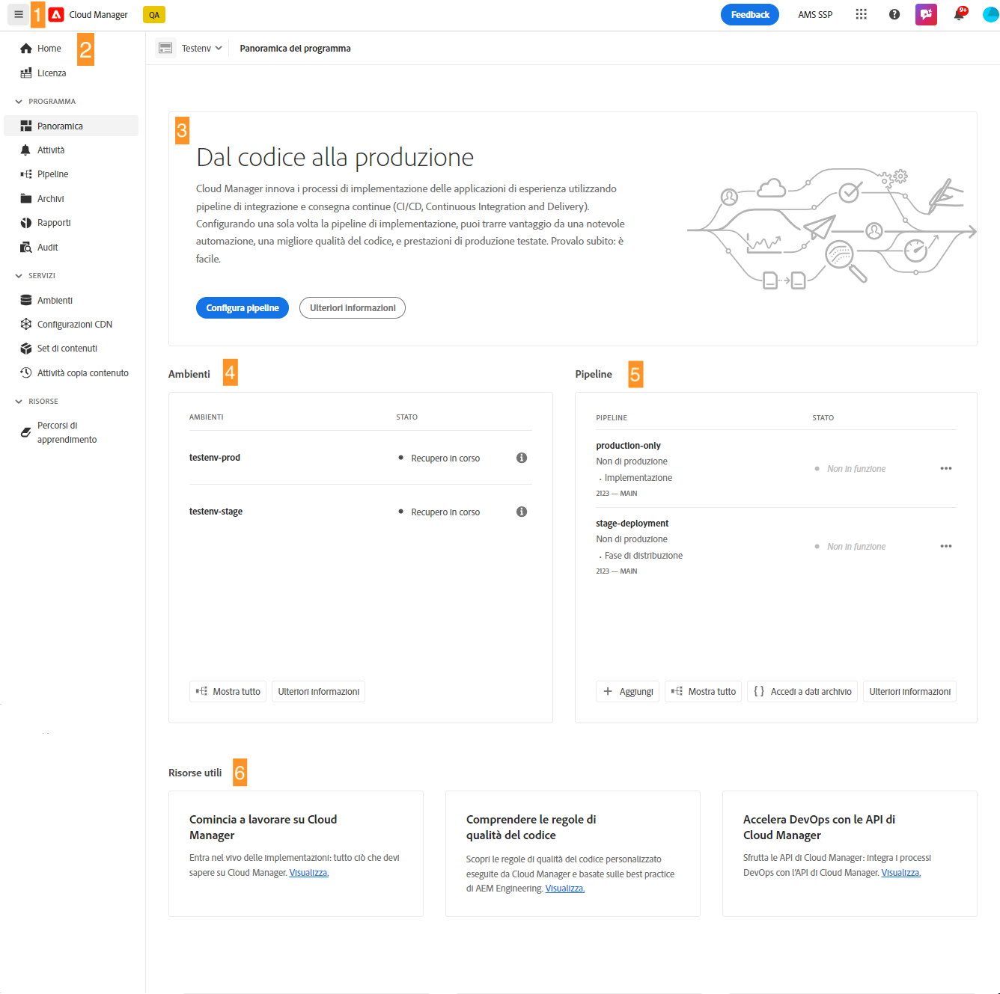

# Navigare nell’interfaccia utente di Cloud Manager {#navigation}

Scopri come è organizzata l’interfaccia utente di Cloud Manager e come spostarsi per gestire i programmi e gli ambienti.

L’interfaccia utente di Cloud Manager è composta principalmente da due interfacce grafiche:

* [La console Programmi personali](#my-programs-console) è la posizione da cui visualizzare e gestire tutti i programmi.
* [La finestra Panoramica del programma](#program-overview) è dove puoi visualizzare i dettagli e gestire un singolo programma.

## Console Programmi personali {#my-programs-console}

Quando accedi a Cloud Manager all’indirizzo [my.cloudmanager.adobe.com](https://my.cloudmanager.adobe.com/) e selezioni l’organizzazione appropriata, vieni indirizzato alla console **Programmi personali**.

La console Programmi personali fornisce una panoramica di tutti i programmi a cui hai accesso nell’organizzazione selezionata. È costituita da diverse elementi.

1. [Barre degli strumenti](#toolbars-my-programs-toolbars) per la selezione di organizzazioni, avvisi e impostazioni account.
1. Schede che consentono di attivare/disattivare la visualizzazione corrente dei programmi.

   * Visualizzazione **Home** (predefinita) che seleziona la visualizzazione **Programmi personali** con una panoramica di tutti i programmi.
   * **Licenza** che accede alla dashboard delle licenze. La dashboard delle licenze si applica solo ai *programmi AEM as a Cloud Service*, non ai programmi AMS. Per determinare il tipo di servizio del programma (AMS o AEMaaCS), consulta la [sezione Schede del programma](#program-cards) di questo documento.
   * Per impostazione predefinita, le schede sono chiuse e possono essere visualizzate utilizzando il menu a discesa dell’icona hamburger, situato sul lato sinistro dell’[intestazione Cloud Manager](#cloud-manager-header).

1. [Statistiche e invito all’azione](#cta-statistics) per una panoramica dell’attività recente
1. Sezione [**Programmi personali** ](#my-programs-section) con una panoramica di tutti i programmi
1. [Collegamenti rapidi](#quick-links) per accedere facilmente alle risorse correlate

>[!TIP]
>
>Per ulteriori informazioni sui programmi, consulta [Programmi e tipi di programmi](/help/getting-started/program-setup.md).

### Barre degli strumenti {#my-programs-toolbars}

Sono disponibili due barre degli strumenti una sopra l’altra.

#### Intestazione di Cloud Manager {#cloud-manager-header}

La prima è l’intestazione Cloud Manager. L’intestazione diventa persistente durante la navigazione in Cloud Manager. Si tratta di un ancoraggio che consente di accedere alle impostazioni e alle informazioni applicabili ai diversi programmi di Cloud Manager.

1. L’icona hamburger a sinistra dell’intestazione è un menu a discesa che fornisce accesso alle schede di parti specifiche di un singolo programma. A seconda del contesto, consente inoltre di passare dalla dashboard delle licenze alla console **[I miei programmi](#my-programs-console)**.
   * La dashboard delle licenze si applica solo ai programmi AEM as a Cloud Service, non ai programmi AMS.
   * Per determinare il tipo di servizio del programma (AMS o AEMaaCS), consulta la [sezione Schede del programma](#program-cards) di questo documento.
1. Il pulsante Cloud Manager ti riporterà alla console Programmi personali al suo interno, indipendentemente dalla tua posizione in Cloud Manager.
1. Fai clic sul pulsante Feedback per fornire un feedback ad Adobe su Cloud Manager.
1. Il selettore organizzazione visualizza l’organizzazione a cui appartieni al momento (in questo esempio, Foundation Internal). Fai clic per passare a un’altra organizzazione se il tuo Adobe ID è associato a più di una.
1. Fai clic sul selettore delle soluzioni per passare rapidamente ad altre soluzioni di Experience Cloud.
1. L’icona dell’aiuto fornisce un accesso rapido alle risorse di apprendimento e supporto.
1. L’icona Notifiche viene contrassegnata con il numero di [notifiche](/help/using/notifications.md) incomplete attualmente assegnate.
1. Seleziona l’icona che rappresenta l’utente per accedere alle impostazioni utente. Se non selezioni un’immagine utente, viene assegnata un’icona in modo casuale.

#### Barra degli strumenti del programma {#program-toolbar}

La barra degli strumenti del programma fornisce collegamenti per passare da programmi ad azioni di Cloud Manager e viceversa appropriati al contesto.

1. Il selettore di programma si apre in un menu a discesa in cui puoi selezionare rapidamente altri programmi o intraprendere azioni appropriate al contesto, ad esempio la creazione di un nuovo programma
1. Il collegamento introduttivo consente di accedere al [percorso di documentazione sull’onboarding](https://experienceleague.adobe.com/it/docs/experience-manager-cloud-service/content/onboarding/journey/overview) per iniziare a utilizzare Cloud Manager.
Il percorso di onboarding è progettato per Cloud Manager su Adobe Experience Manager as a Cloud Service (AEMaaCS) e non per Cloud Manager su Adobe Managed Services (AMS). Tuttavia, molti concetti sono gli stessi.
1. Il pulsante di azione offre azioni appropriate al contesto, ad esempio la creazione di un nuovo programma.

### Invito all’azione e statistiche {#cta-statistics}

La sezione Invito all’azione e statistiche fornisce dati aggregati per l’organizzazione. Ad esempio, se i programmi sono stati configurati correttamente, è possibile che vengano visualizzate le statistiche delle attività degli ultimi 90 giorni, tra cui:

* Numero di [implementazioni](/help/using/code-deployment.md)
* Numero di [problemi di qualità del codice](/help/using/code-quality-testing.md) identificati
* Numero di build

Oppure, se stai iniziando la configurazione dell’organizzazione, potrebbero essere disponibili suggerimenti sui passaggi successivi o sulle risorse della documentazione.

### Programmi personali {#my-programs-section}

Il contenuto principale della console Programmi personali è la sezione **Programmi personali** in cui i programmi sono elencati come singole schede. Fai clic su una scheda per accedere alla pagina **Panoramica del programma** per informazioni dettagliate sul programma.

>[!NOTE]
>
>A seconda dei privilegi di cui disponi, potrebbe non essere possibile selezionare alcuni programmi.

Utilizza le opzioni di ordinamento seguenti per trovare meglio il programma necessario:

* Ordina per
   * Data di creazione (impostazione predefinita)
   * Nome del programma
   * Stato
* Crescente (predefinito) / Decrescente
* Vista griglia (predefinito)
* Vista a elenco

#### Schede del programma {#program-cards}

Una scheda o riga in una tabella rappresenta ogni programma, fornendo una panoramica del programma e collegamenti rapidi per intraprendere azioni.

* Immagine del programma (se configurata)
* Nome del programma
* Tipo di servizio:
   * **Experience Manager** per i programmi AMS
   * **Experience Manager Cloud** per [programmi AEM as a Cloud Service](https://experienceleague.adobe.com/it/docs/experience-manager-cloud-service/content/implementing/home)
* Stato
* Soluzioni configurate
* Data di creazione

L’icona delle informazioni consente inoltre di accedere rapidamente a informazioni aggiuntive sul programma (utili nella vista a elenco).

L’icona con i puntini di sospensione ti permette di accedere alle azioni aggiuntive che puoi intraprendere sul programma.

* Passare a un determinato [ambiente](/help/using/managing-environments.md) del programma
* Apri la [Panoramica del programma](#program-overview)
* [Modifica il programma](/help/getting-started/program-setup.md)
* Mostra monitoraggio

### Collegamenti rapidi {#quick-links}

La sezione dei collegamenti rapidi consente di accedere alle risorse correlate di uso comune.

## Finestra Panoramica del programma {#program-overview}

Se si seleziona un programma nella console [**Programmi personali**](#my-programs-console), viene visualizzata la pagina **Panoramica del programma**.

La panoramica del programma consente di accedere a tutti i dettagli di un programma di Cloud Manager. Come la console Programmi personali, è composta da diverse parti.

1. [Barre degli strumenti](#program-overview-toolbar) per tornare rapidamente alla console **Programmi personali** e passare al programma.
1. [Schede](#program-tabs) per passare da un aspetto all’altro del programma.
1. [Invito all’azione](#cta) basato sulle ultime azioni del programma.
1. [Panoramica degli ambienti](#environments) del programma.
1. [Panoramica delle pipeline](#pipelines) del programma.
1. Collegamenti a [risorse utili](#useful-resources).

### Barre degli strumenti {#program-overview-toolbar}

Le barre degli strumenti per la panoramica del programma sono molto simili a quelle della [console I miei programmi](#my-programs-toolbars). Qui sono illustrate solo le differenze.

#### Intestazione di Cloud Manager {#cloud-manager-header-2}

L’intestazione di Cloud Manager dispone di un menu hamburger che si apre in automatico per mostrare le schede navigabili della panoramica del programma.

Fai clic sull’icona “hamburger” per nascondere le schede.

#### Barra degli strumenti del programma {#program-toolbar-2}

La barra degli strumenti del programma consente di passare rapidamente ad altri programmi, ma anche di accedere ad azioni appropriate al contesto, come l’aggiunta e la modifica del programma.

Inoltre, se nascondi le schede utilizzando l’icona “hamburger”, la barra degli strumenti può comunque mostrare la scheda in cui ti trovi attualmente.

### Schede Programma {#program-tabs}

A ogni programma sono associate molte opzioni e molti dati. Questi dati vengono raccolti in schede per semplificare la navigazione nel programma. Le schede consentono di accedere a:

* Panoramica: la panoramica del programma come descritto nel documento corrente
* [Attività](/help/using/managing-pipelines.md#activity): la cronologia delle esecuzioni delle pipeline del programma
* [Pipeline](/help/using/managing-pipelines.md#pipelines): tutte le pipeline configurate per il programma
* [Archivi](/help/managing-code/managing-repositories.md): tutti gli archivi configurati per il programma
* [Rapporti](/help/using/monitoring-environments.md#system-monitoring-overview): metriche quali i dati SLA
* [Ambienti](/help/using/managing-environments.md): tutti gli ambienti configurati per il programma
* [Set di contenuti](/help/using/content-copy.md): set di contenuti creati per scopi di copia
* [Attività copia contenuto](/help/using/content-copy.md): attività di copia dei contenuti
* Percorsi di apprendimento: risorse di apprendimento aggiuntive su Cloud Manager

Per impostazione predefinita, quando si apre un programma si accede alla scheda **Panoramica**. Viene evidenziata la scheda corrente. Seleziona un’altra scheda per visualizzarne i dettagli.

Utilizza il menu hamburger nell’[intestazione di Cloud Manager](#cloud-manager-header-2) per nascondere le schede.

### Invito all’azione {#cta}

La sezione relativa agli inviti all’azione fornisce informazioni utili in base allo stato del programma. Per un nuovo programma puoi vedere i passaggi successivi offerti e un promemoria della data di pubblicazione, [impostato durante la creazione del programma](/help/getting-started/program-setup.md).

Per un programma live, lo stato dell’ultima implementazione con collegamenti per i dettagli e l’avvio di una nuova implementazione.

### Scheda Ambienti {#environments}

La scheda **Ambienti** offre una panoramica degli ambienti e collegamenti per azioni rapide.

Nella scheda **Ambienti** sono elencati solo tre ambienti. Per visualizzare tutti gli ambienti del programma, fai clic su **Mostra tutto**.

Per informazioni dettagliate su come gestire gli ambienti, consulta [Gestione degli ambienti](/help/using/managing-environments.md).

### Scheda Pipeline {#pipelines}

La scheda **Pipeline** offre una panoramica delle pipeline e collegamenti per azioni rapide.

Nella scheda **Pipeline** sono elencate solo tre pipeline. Per visualizzare tutte le pipeline del programma, fai clic su **Mostra tutto**.

Per informazioni dettagliate su come gestirle, consulta [Gestione delle pipeline](/help/using/managing-pipelines.md).

### Risorse utili {#useful-resources}

La sezione **Risorse utili** fornisce collegamenti a risorse di apprendimento aggiuntive per Cloud Manager.
