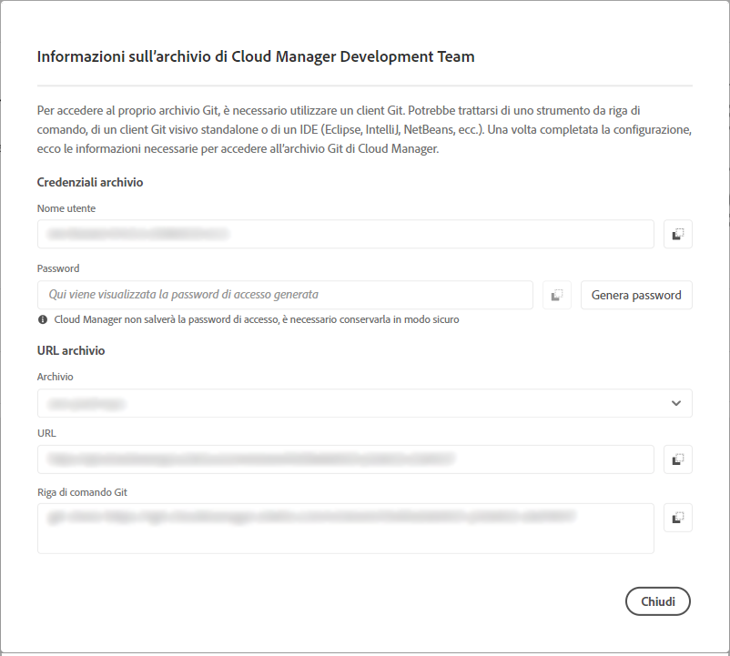

# Informazioni di accesso all’archivio {#accessing-repos}

Scopri come accedere e gestire gli archivi Git gestiti da Adobe utilizzando la gestione account Git self-service da Cloud Manager.

## Accesso ai dati dell’archivio dalla pagina Panoramica {#overview-page}

Cloud Manager consente di recuperare facilmente le informazioni di accesso agli archivi gestiti da Adobe mediante **Accedi a dati archivio** dalla scheda **Pipeline**.

La finestra di dialogo **Informazioni archivio** consente di visualizzare le seguenti informazioni di accesso per gli archivi gestiti da Adobe:

* Il nome utente di Git.
* La password di Git.
* L’URL dell’archivio Git di Cloud Manager.
* Comandi Git predefiniti per aggiungere rapidamente un remoto all’archivio Git e inviare il codice.

  

L’accesso alle informazioni degli [archivi privati](/help/managing-code/private-repositories.md) non è disponibile in Cloud Manager.

La funzione **Accedi a dati archivio** è visibile agli utenti con i ruoli **Sviluppatore** o **Responsabile dell’implementazione**.

**Per accedere alle informazioni dell’archivio dalla pagina Panoramica:**

1. Accedi a Cloud Manager all’indirizzo [my.cloudmanager.adobe.com](https://my.cloudmanager.adobe.com/) e seleziona l’organizzazione e il programma appropriati.

1. Dalla pagina **Panoramica del programma**, nella scheda **Pipeline**, fai clic su **Accedi a dati archivio**.

   

1. Per accedere alla password, è necessario generare una nuova password. Nella finestra di dialogo **Informazioni archivio**, seleziona **Genera password**.

1. Nella finestra di dialogo di conferma, seleziona **Genera password**.

1. A destra del campo **Password**, fai clic sull’ per copiare la password negli appunti.

   * La generazione di una password invalida la password precedente.
   * Cloud Manager non salverà la password. È tua responsabilità salvare la password in modo sicuro.
   * Se la password viene persa, è necessario rigenerarne una nuova, poiché Cloud Manager non la salva.

   

Con queste credenziali puoi clonare una copia locale dell’archivio, apportare qui le modifiche e, una volta terminato, riconfermarle nell’archivio del codice remoto in Cloud Manager.

## Accesso alle informazioni dell’archivio dalla finestra Archivi {#repositories-window}

La funzione **Accedi a dati archivio** è disponibile anche nella pagina [**Archivi**](/help/managing-code/managing-repositories.md). Visualizza le stesse informazioni sull’accesso agli archivi gestiti da Adobe.

## Revoca di una password di accesso {#revoke-password}

Puoi revocare una password di accesso in qualsiasi momento.

Per farlo, [crea un ticket di supporto per questa richiesta](https://experienceleague.adobe.com/?support-solution=Experience+Manager&amp;support-tab=home?lang=it#support). Il ticket sarà trattato con priorità alta e solitamente revocato nell’arco di una giornata.
