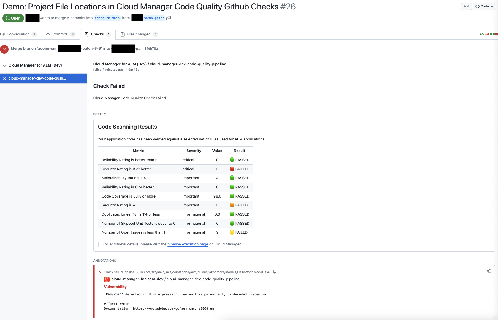
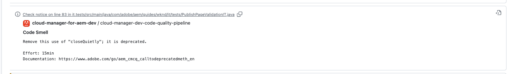
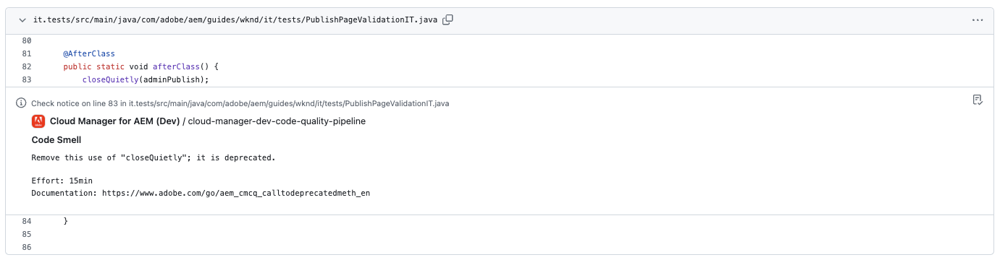
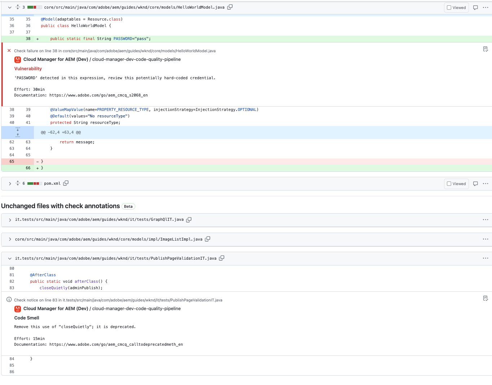
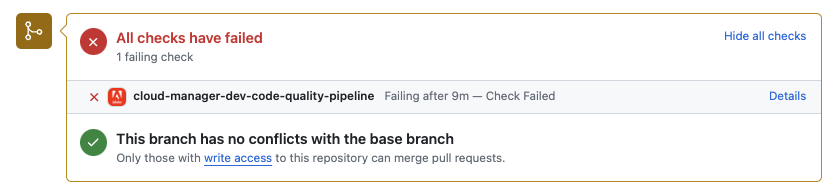
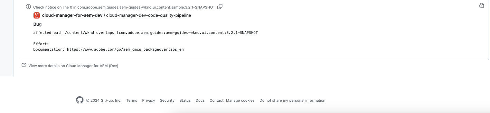

# Annotazioni di controllo GitHub {#github-annotations}

Scopri come GitHub controlla le annotazioni PR negli archivi privati per fornirti un feedback.

## Panoramica {#overview}

Se utilizzi [archivi privati](private-repositories.md) per il tuo programma Cloud Manager, i controlli in GitHub vengono eseguiti automaticamente per ogni richiesta pull. Questi controlli vengono annotati con informazioni che consentono di identificare al più presto eventuali problemi del codice.

I problemi di [Qualità del codice](/help/using/code-quality-testing.md) rilevati da [SonarQube](/help/using/custom-code-quality-rules.md) sono elencati in modo chiaro.

Viene fornita la riga di codice esatta con il problema e puoi selezionarla per visualizzare il codice pertinente. Queste annotazioni vengono fornite per tutti i problemi di codice, non solo per quelli della richiesta di pull.

Tutte le righe con annotazioni vengono aggregate nella scheda **File modificati** nella richiesta pull di GitHub. Le annotazioni per i file non modificati nella richiesta di pull vengono visualizzate in una sezione separata.

## Pipeline di qualità del codice {#code-quality-pipelines}

I risultati di [Qualità codice](/help/using/code-quality-testing.md) sono visibili anche nella pipeline, che Cloud Manager attiva automaticamente, nella parte inferiore della scheda **Controlli**. È inoltre accessibile dai **Dettagli** del controllo della richiesta di pull.

Puoi anche visualizzare i problemi come file CSV. Puoi accedere a queste informazioni [visualizzando i dettagli dell&#39;esecuzione della pipeline in Cloud Manager](/help/using/managing-pipelines.md).
