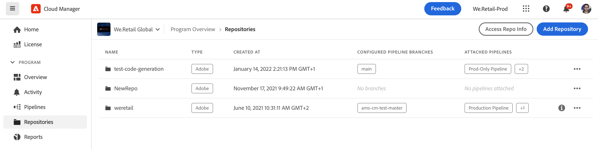
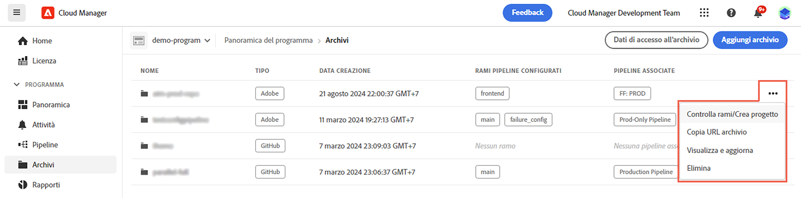
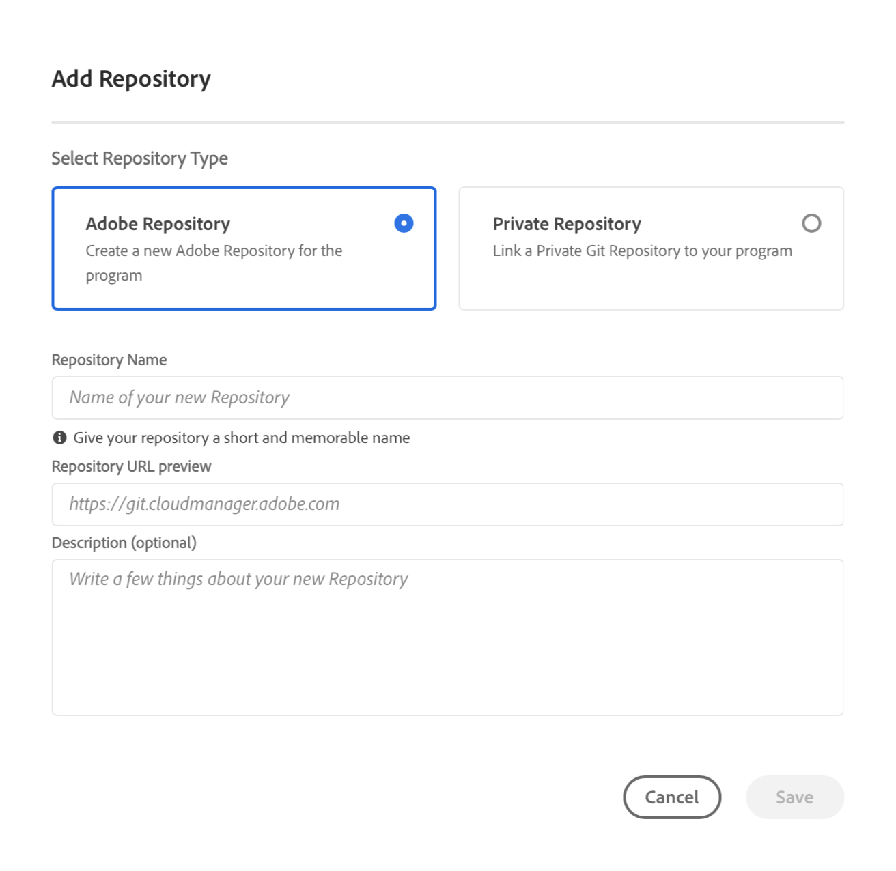
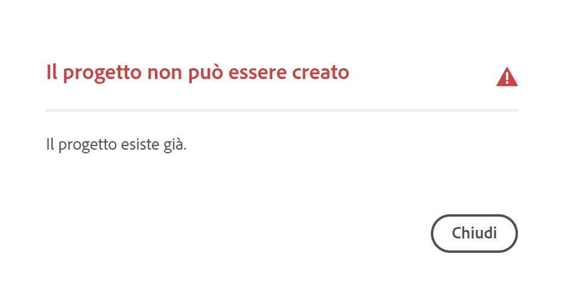

# Archivi di Cloud Manager {#cloud-manager-repos}

Scopri come creare, visualizzare e modificare gli archivi Git in Cloud Manager.

## Panoramica {#overview}

Gli archivi vengono utilizzati per archiviare e gestire il codice del progetto utilizzando Git. Per ogni programma che crei in Cloud Manager viene creato un archivio gestito da Adobe.

Puoi creare archivi aggiuntivi gestiti da Adobe e puoi anche aggiungere archivi privati. Tutti gli archivi associati al programma possono essere visualizzati nella finestra **Archivi**.

Gli archivi creati in Cloud Manager sono disponibili per la selezione anche quando aggiungi o modifichi le pipeline. Per ulteriori informazioni, consulta [Pipeline CI-CD](/help/overview/ci-cd-pipelines.md).

Esiste un singolo archivio principale o ramo per ogni pipeline. Grazie al [supporto dei sottomoduli Git](git-submodules.md), al momento della creazione è possibile aggiungere molti rami secondari.

## Finestra Archivi {#repositories-window}

1. Accedi a Cloud Manager all’indirizzo [my.cloudmanager.adobe.com](https://my.cloudmanager.adobe.com/) e seleziona l’organizzazione e il programma appropriati.

1. Dalla pagina **Panoramica del programma**, seleziona la scheda **Archivi** per passare alla pagina **Archivi**.

1. Nella finestra **Archivi** vengono visualizzati tutti gli archivi associati al programma.

   

La finestra **Archivi** fornisce dettagli sugli archivi:

* Tipo di archivio
   * **Adobe** indica archivi gestiti da Adobe
   * **GitHub** indica archivi GitHub privati che gestisci tu direttamente
* Data di creazione
* Pipeline associate all’archivio

In questa finestra puoi selezionare un archivio e fare clic sul pulsante con i puntini di sospensione per intervenire sull’archivio selezionato.

* **[Controlla rami/Crea progetto](#check-branches)** (disponibile solo per gli archivi Adobe)
* **[Copia URL archivio](#copy-url)**
* **[Visualizza e aggiorna](#view-update)**
* **[Elimina](#delete)**

## Aggiunta di archivi {#adding-repositories}

Tocca o fai clic sul pulsante **Aggiungi archivio** nella finestra **Archivi** per avviare la procedura guidata **Aggiungi archivio**.

Cloud Manager supporta sia gli archivi gestiti da Adobe (**Archivio Adobe**) sia quelli che puoi gestire direttamente (**Archivio privato**). I campi obbligatori dipendono dal tipo di archivio che scegli di aggiungere. Per ulteriori dettagli, consulta i seguenti documenti.

* [Aggiunta di archivi Adobe in Cloud Manager](adobe-repositories.md)
* [Aggiunta di archivi privati in Cloud Manager](private-repositories.md)

>[!NOTE]
>
>* Per poter aggiungere un archivio, l’utente deve avere il ruolo **Manager implementazione** o **Proprietario business**.
>* Per ogni azienda o organizzazione IMS, vi è un limite di 300 archivi per tutti i programmi.

## Accedi a dati archivio {#repo-info}

Quando visualizzi gli archivi nella finestra **Archivi**, puoi visualizzare i dettagli su come accedere agli archivi gestiti da Adobe a livello di programmazione toccando o facendo clic sul pulsante **Accedi a dati archivio** nella barra degli strumenti.

La finestra **Informazioni archivio** si apre con i dettagli. Per ulteriori informazioni sull’accesso alle informazioni dell’archivio, consulta il documento [Accesso alle informazioni sull’archivio.](accessing-repositories.md)

## Controlla rami {#check-branches}

L’azione **Controlla rami/Crea progetto** esegue due funzioni a seconda dello stato dell’archivio.

* Se l’archivio è stato appena creato, l’azione crea un progetto di esempio basato sull’[Archetipo progetto AEM.](https://experienceleague.adobe.com/it/docs/experience-manager-core-components/using/developing/archetype/overview)
* Se nell’archivio è già stato creato il progetto di esempio, viene verificato lo stato dell’archivio e dei relativi rami e vengono generati rapporti se il progetto di esempio esiste già.

## Copia URL archivio {#copy-url}

L’azione **Copia URL archivio** copia negli Appunti l’URL dell’archivio selezionato nella finestra **Archivi**, per utilizzarlo altrove.

## Visualizza e aggiorna {#view-update}

L’azione **Visualizza e aggiorna** apre la finestra di dialogo **Aggiorna archivio**. Questo permette di visualizzare **Nome** e **Anteprima URL archivio** nonché di aggiornare la **Descrizione** dell’archivio.

## Elimina {#delete}

L’azione **Elimina** rimuove l’archivio dal progetto. Un archivio non può essere eliminato se è associato a una pipeline.

Nota che quando un archivio viene eliminato in Cloud Manager, viene contrassegnato come eliminato e non è più accessibile all’utente, ma viene mantenuto nel sistema a scopo di ripristino.

Se tenti di creare un nuovo archivio dopo averne eliminato uno con lo stesso nome, riceverai il messaggio di errore `An error has occurred while trying to create repository. Please contact your CSE or Adobe Support.`

Se ricevi questo messaggio di errore, contatta il supporto Adobe in modo che possa aiutarti a rinominare l’archivio eliminato o scegliere un nome diverso per quello nuovo.
