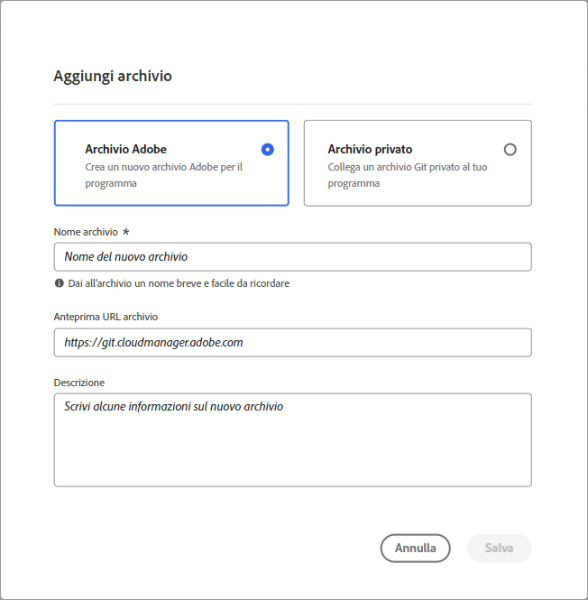
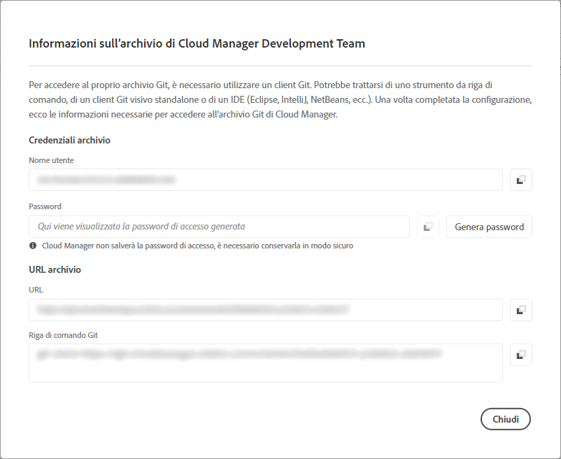
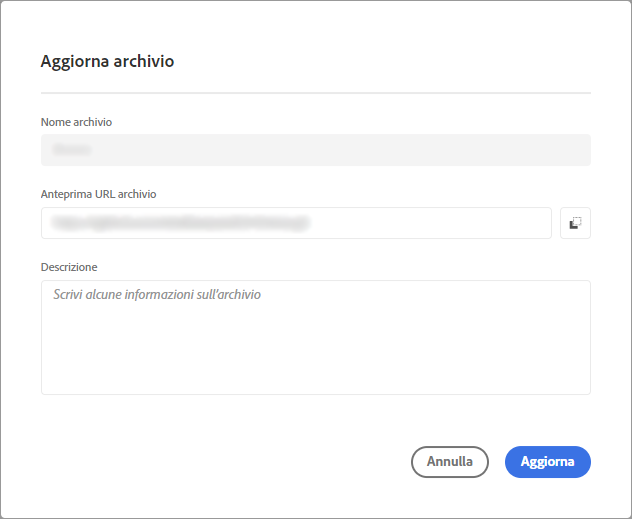

# Gestire archivi in Cloud Manager {#cloud-manager-repos}

Scopri come visualizzare, aggiungere ed eliminare un archivio Git in Cloud Manager.

## Panoramica {#overview}

Gli archivi in Cloud Manager vengono utilizzati per memorizzare e gestire il codice del progetto utilizzando Git. Per ogni *programma* aggiunto, viene automaticamente creato un archivio gestito da Adobe.

Inoltre, puoi creare altri archivi gestiti da Adobe o aggiungere archivi privati. Tutti gli archivi collegati al programma possono essere visualizzati nella pagina **Archivi**.

Gli archivi creati all’interno di Cloud Manager possono essere selezionati anche quando si aggiungono o modificano le pipeline. Per ulteriori informazioni sulla configurazione delle pipeline, consulta [Pipeline CI-CD](/help/overview/ci-cd-pipelines.md).

Ogni pipeline è collegata a un archivio o ramo principale. Tuttavia, con il supporto per il modulo secondario [Git](/help/managing-code/git-submodules.md), è possibile includere più rami secondari durante il processo di compilazione.

## Visualizzare la pagina Archivi {#repositories-window}

Nella pagina **Archivi** è possibile visualizzare i dettagli dell&#39;archivio selezionato. Queste informazioni includono il tipo di archivio in uso. Se l&#39;archivio è contrassegnato come **Adobe**, indica che si tratta di un archivio gestito da Adobe. Se è etichettato come **GitHub**, fa riferimento a un archivio GitHub privato che gestisci. Inoltre, la pagina fornisce dettagli quali quando è stato creato l’archivio e le relative pipeline associate.

Per intervenire su un repository selezionato, è possibile fare clic su di esso e utilizzare l&#39;icona  per aprire un menu a discesa. Ad Adobe, gli archivi gestiti possono **[Controllare rami / Creare un progetto](#check-branches)**.

*Menu a discesa nella pagina Archivi.*

Altre azioni disponibili nel menu a discesa includono **[Copia URL archivio](#copy-url)**, **[Visualizza e aggiorna](#view-update)** e **[Elimina](#delete)** l&#39;archivio.

**Per visualizzare la pagina Archivi:**

1. Accedi a Cloud Manager all’indirizzo [my.cloudmanager.adobe.com](https://my.cloudmanager.adobe.com/) e seleziona l’organizzazione e il programma appropriati.

1. Nella pagina **Panoramica programma**, dal menu laterale, fare clic sull&#39;icona  **Archivi**.

1. Nella pagina **Archivi** sono visualizzati tutti gli archivi associati al programma selezionato.

   
   *Pagina Archivi in Cloud Manager.*

## Aggiungere un archivio {#adding-repositories}

Per aggiungere un archivio, l&#39;utente deve avere il ruolo **Responsabile dell&#39;implementazione** o **Proprietario business**.

Nella pagina **Archivi**, nell&#39;angolo superiore destro, fare clic su **Aggiungi archivio**

*Finestra di dialogo Aggiungi archivio.*

Cloud Manager supporta due tipi di repository: repository gestiti da Adobe (**repository Adobe**) e repository gestiti automaticamente (**repository privato**). I campi obbligatori per l’impostazione variano a seconda del tipo di archivio scelto per l’aggiunta. Per ulteriori informazioni, consulta:

* [Aggiungere archivi Adobe in Cloud Manager](/help/managing-code/adobe-repositories.md)
* [Aggiungere archivi privati in Cloud Manager](/help/managing-code/private-repositories.md)

Per ogni azienda o organizzazione IMS, vi è un limite di 300 archivi per tutti i programmi.

## Accedere alle informazioni dell’archivio {#repo-info}

Quando visualizzi gli archivi nella finestra **Archivi**, puoi visualizzare i dettagli su come accedere agli archivi gestiti da Adobe a livello di programmazione facendo clic sul pulsante **Accedi a dati archivio** nella barra degli strumenti.

La finestra **Informazioni archivio** si apre con i dettagli. Per ulteriori informazioni sull’accesso alle informazioni dell’archivio, consulta [Accesso alle informazioni sull’archivio](/help/managing-code/accessing-repositories.md).

## Controlla rami/Crea progetto {#check-branches}

In **AEM Cloud Manager**, l&#39;azione **Controlla rami / Crea progetto** ha due scopi, a seconda dello stato corrente dell&#39;archivio.

* Se l&#39;archivio è stato appena creato, questa azione genera un progetto di esempio utilizzando [l&#39;archetipo del progetto AEM](https://experienceleague.adobe.com/it/docs/experience-manager-core-components/using/developing/archetype/overview).
* Se il progetto di esempio è già stato creato nel repository, l’azione controlla lo stato del repository e dei relativi rami, fornendo feedback sull’esistenza del progetto di esempio.

  

## Copiare l’URL dell’archivio {#copy-url}

L&#39;azione **Copia URL archivio** copia l&#39;URL dell&#39;archivio selezionato nella pagina **Archivi** negli Appunti per utilizzarlo altrove.

## Visualizzare e aggiornare un archivio {#view-update}

L&#39;azione **Visualizza e aggiorna** apre la finestra di dialogo **Aggiorna archivio**, in cui è possibile visualizzare l&#39;anteprima dell&#39;URL del repository **Nome** e ****. Consente inoltre di aggiornare la **Descrizione** dell&#39;archivio.

## Eliminare un archivio {#delete}

L’azione **Elimina** rimuove l’archivio dal progetto. Un archivio non può essere eliminato se è associato a una pipeline.

Quando un archivio viene eliminato in Cloud Manager, viene contrassegnato come eliminato e non è più accessibile all’utente. Tuttavia, viene mantenuto nel sistema per scopi di ripristino.

Se si tenta di creare un nuovo repository dopo aver eliminato un repository con lo stesso nome, viene visualizzato il seguente messaggio di errore:

`An error has occurred while trying to create repository. Contact your CSE or Adobe Support.`

Se ricevi questo messaggio di errore, contatta l’Assistenza Adobe. Possono essere utili per rinominare l’archivio eliminato o scegliere un nome diverso per il nuovo archivio.
