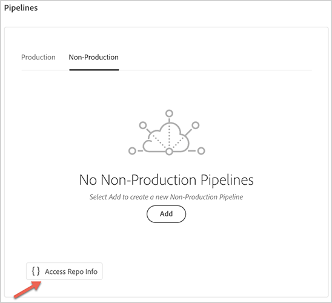

# Accesso agli archivi {#accessing-repos}

Puoi accedere e gestire il tuo archivio Git utilizzando Self-Service Git Account Management (Gestione account Git self-service) dall’interfaccia utente di Cloud Manager.

## Utilizzo della gestione account Git self-service {#self-service-git}

Utilizza il pulsante **Access Repo Info** disponibile dall’interfaccia utente di Cloud Manager, che si trova più in evidenza sulla scheda della pipeline.

1. Passa alla scheda **Pipelines** dalla pagina **Panoramica del programma**.

1. Per accedere e gestire l’archivio Git, visualizzerai l’opzione **Access Repo Info** .

   

   Inoltre, se selezioni la scheda della pipeline **Non-Produzione** , visualizzerai anche l&#39;opzione **Accedi alle informazioni sul repository**.

   

   >[!NOTE]
   >L&#39;opzione **Access Repo Info** è visibile agli utenti nel ruolo Developer o Deployment Manager. Facendo clic su questo pulsante si apre una finestra di dialogo che consente all’utente di trovare l’URL del proprio archivio Git di Cloud Manager insieme al nome utente e alla password.

   

   Le considerazioni importanti per gestire il Git in Cloud Manager sono le seguenti:

   * **URL**: URL del repository
   * **Nome utente**: Nome utente
   * **Password**: valore visualizzato quando si fa clic sul pulsante **Generate Password (Genera password)**.

      >[!NOTE]
      >Un utente può estrarre una copia del proprio codice e apportare modifiche nell&#39;archivio del codice locale. Quando è pronto, l’utente può eseguire nuovamente il commit delle modifiche del codice nell’archivio del codice remoto in Cloud Manager.
