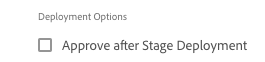
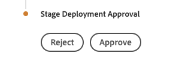
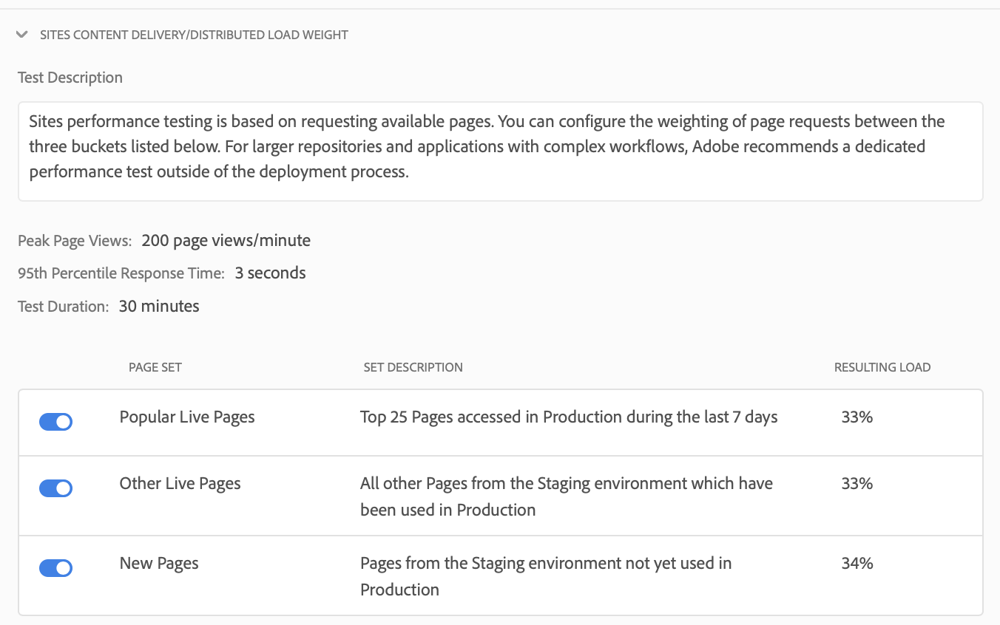

# Configurare la pipeline CI/CD {#configure-your-ci-cd-pipeline}

Nella pagina seguente viene illustrato come configurare la **tubazione**. Per maggiori informazioni concettuali sul funzionamento della tubazione, consulta la panoramica [della pipeline](ci-cd-pipeline.md)CI/CD.

## Esercitazione video {#video-tutorial-one}

### Configurazione della pipeline in Cloud Manager {#config-pipeline-video}

La configurazione della pipeline di produzione CI/CD definisce il trigger che avvierà la pipeline, i parametri che controllano la distribuzione di produzione e i parametri di test delle prestazioni.

>[!VIDEO](https://video.tv.adobe.com/v/26314/)

## Informazioni sul flusso {#understanding-the-flow}

Puoi configurare la pipeline dalla sezione **Pipeline Settings (Impostazioni pipeline)** dell’interfaccia utente di [!UICONTROL Cloud Manager].

Gestione distribuzione è responsabile della configurazione della pipeline. In questo caso, selezionate prima un ramo dall&#39;archivio **Git**. La configurazione della tubazione è costituita da:

* definizione del trigger che avvierà la pipeline.
* definizione dei parametri che controllano la distribuzione di produzione.
* configurazione dei parametri del test delle prestazioni.

## Impostazione della tubazione {#setting-up-the-pipeline}

>[!CAUTION]
>
>Impossibile impostare la pipeline finché l&#39;archivio Git non dispone di almeno una diramazione e l&#39;impostazione [del](setting-up-program.md) programma non è completa.

Prima di iniziare a distribuire il codice, devi configurare le impostazioni della pipeline dal [!UICONTROL Cloud Manager].

>[!NOTE]
>
>È possibile modificare le impostazioni della pipeline dopo la configurazione iniziale.

### Configurazione delle impostazioni della tubazione da [!UICONTROL Cloud Manager] {#configuring-the-pipeline-settings-from-cloud-manager}

Una volta configurato il programma utilizzando l&#39; [!UICONTROL Cloud Manager] interfaccia utente, è possibile impostare la pipeline.

Per configurare il comportamento e le preferenze della pipeline, effettuate le seguenti operazioni:

1. Fate clic su **Imposta tubazione** per impostare e configurare la tubazione.

   

1. Viene visualizzata la schermata **Configurazione tubazione** .

   La procedura guidata in tre fasi consente di configurare l&#39;ambiente **ramo**, **ambienti** e **test** .
Selezionate il ramo Git e fate clic su **Avanti**.

   >[!NOTE]
   >
   >Le filiali presenti nel repository Git sono collegate al programma.

   

1. Accedete alla scheda **Ambienti** per selezionare le opzioni **Stage** e **Produzione** .

   È possibile definire l&#39;attivatore per avviare la pipeline:

   * **Su modifiche** Git - avvia la pipeline CI/CD ogni volta che vengono aggiunti impegni al ramo git configurato. Anche se selezionate questa opzione, potete sempre avviare la pipeline manualmente.
   * **Manuale** : l&#39;utilizzo dell&#39;interfaccia utente consente di avviare manualmente la pipeline.

   Durante la configurazione o la modifica della pipeline, Gestione distribuzione ha la possibilità di definire il comportamento della pipeline quando si verifica un errore importante in una delle porte di qualità come Qualità del codice, Test di sicurezza e Test delle prestazioni.

   Questo è utile per i clienti che desiderano un maggior numero di processi automatizzati. Le opzioni disponibili sono:

* **Chiedi ogni volta** - Questa è l&#39;impostazione predefinita e richiede l&#39;intervento manuale su qualsiasi errore importante.
* **Errore immediato** - Se selezionato, la pipeline verrà annullata ogni volta che si verifica un errore importante. In pratica, questo consente di emulare manualmente un utente che rifiuta ogni errore.
* **Continua immediatamente** : se questa opzione è selezionata, la pipeline procederà automaticamente ogni volta che si verifica un errore importante. Si tratta essenzialmente di un&#39;emulazione manuale di un utente che approva ogni errore.

   Ora definite i parametri che controllano la distribuzione di produzione. Le tre opzioni disponibili sono le seguenti:

* **Usa approvazione** Go Live - Una distribuzione deve essere approvata manualmente da un proprietario aziendale, da un project manager o da un manager distribuzione tramite l&#39; [!UICONTROL Cloud Manager] interfaccia utente.
* **Usa CSE Oversight** : un CSE è impegnato per avviare effettivamente la distribuzione. Durante l&#39;impostazione della pipeline o la modifica quando CSE Oversight è abilitato, Gestione distribuzione ha l&#39;opzione di selezionare:

   * **Eventuali CSE**: si riferisce a qualsiasi CSE disponibile
   * **CSE** personale: si riferisce a un caso specifico assegnato al cliente o al suo backup, se il caso è fuori ufficio

* **Pianificato** : questa opzione consente all&#39;utente di abilitare la distribuzione di produzione pianificata.

>[!NOTE]
>
>Se è selezionata l&#39;opzione **Pianificato** , potete pianificare la distribuzione di produzione nella pipeline **dopo** la distribuzione dell&#39;area di visualizzazione (e **Usa approvazione** GoLive, se questa è stata abilitata) in modo da attendere l&#39;impostazione di una pianificazione. L&#39;utente può anche scegliere di eseguire immediatamente la distribuzione di produzione.
>
>Fare riferimento a [**Distribuzione del codice**](deploying-code.md), per impostare la pianificazione della distribuzione o eseguire la produzione immediatamente.

>[!NOTE]
>
>L&#39;opzione **Usa controllo** CSE non è disponibile per tutti i clienti.

**Approva dopo la distribuzione dello stage**

È disponibile un passaggio facoltativo **Approva dopo la distribuzione** dell&#39;area di produzione che può essere configurato nella pipeline di produzione.
Questa opzione è attivata in una nuova opzione nella schermata di modifica **della** tubazione:

Viene quindi visualizzata come un passaggio separato durante l&#39;esecuzione della pipeline:

>[!NOTE]
>
>**L&#39;approvazione dopo la distribuzione** dello stage funziona in modo simile all&#39;approvazione prima dell&#39;implementazione della produzione, ma avviene immediatamente dopo il passaggio di distribuzione dello stadio, ovvero prima che venga eseguito un test, rispetto all&#39;approvazione prima dell&#39;implementazione della produzione, che viene fatta dopo che il test è stato completato.

**Annullamento convalida dispatcher**

In qualità di Gestione distribuzione, potete configurare un set di percorsi di contenuto che verranno **invalidati** o **scaricati** dalla cache del dispatcher AEM per le istanze di pubblicazione, durante la configurazione o la modifica della pipeline.

Potete configurare un set di percorsi separato per la distribuzione di Stage e Produzione. Se configurate, queste azioni della cache verranno eseguite come parte del passaggio della pipeline di distribuzione, subito dopo la distribuzione di eventuali pacchetti di contenuto. Queste impostazioni utilizzano il comportamento standard AEM Dispatcher. L&#39;opzione Annulla validità esegue un&#39;annullamento della validità della cache, simile a quando il contenuto viene attivato dall&#39;autore alla pubblicazione; flush esegue un&#39;eliminazione della cache.

In generale, l&#39;uso dell&#39;azione di annullamento della validità è preferibile, ma in alcuni casi potrebbe essere necessario eseguire lo scaricamento, soprattutto quando si utilizzano AEM HTML Client Libraries.

>[!NOTE]
>
>Fare riferimento a [Dispatcher Overview](dispatcher-configurations.md) (Panoramicadel dispatcher) per ulteriori informazioni sul caching del dispatcher.

Segui i passaggi indicati di seguito per configurare le invalide del dispatcher:

1. Fate clic su **Configura** sotto l’intestazione Configurazione dispatcher

   

1. Immettete il percorso, selezionate l’azione da **Tipo** e fate clic su **Aggiungi**. Potete specificare fino a 100 percorsi per ambiente. Dopo aver aggiunto i percorsi, fate clic su **Applica**.

   

1. Una volta visualizzata nuovamente la pagina Impostazioni **** tubazione, viene visualizzato un riepilogo aggiornato delle selezioni.

   Fate clic su **Salva** per mantenere la configurazione.

   

1. Accedete alla scheda **Test** per definire i criteri di test per il programma.

   Ora potete configurare i parametri del test delle prestazioni.

   Potete configurare *AEM Sites* e *AEM Assets* Performance Testing, a seconda dei prodotti per i quali disponete della licenza.

   **AEM Sites:**

   Cloud Manager esegue il test delle prestazioni per  programmi AEM Sites richiedendo pagine (come utente non autenticato per impostazione predefinita) sul server di pubblicazione dell’area di visualizzazione per un periodo di test di 30 minuti e misurando il tempo di risposta per ciascuna pagina e varie metriche a livello di sistema. Queste richieste sono effettuate da un set di indirizzi noti e dedicati. Gli intervalli di indirizzi possono essere ottenuti dal Customer Success Engineer o  rappresentante del Adobe.

   Prima dell&#39;inizio del periodo di test di 30 minuti, Cloud Manager eseguirà la ricerca per indicizzazione nell&#39;ambiente Stage utilizzando un set di uno o più URL *iniziali* configurati dal Customer Success Engineer. A partire da questi URL, l’HTML di ciascuna pagina viene ispezionato e i collegamenti vengono attraversati in modo completamente lineare. Questo processo di ricerca per indicizzazione è limitato a un massimo di 5000 pagine. Le richieste del crawler hanno un timeout fisso di 10 secondi.

   Le pagine sono selezionate da tre set **di** pagine; potete scegliere da uno a tutti e tre i set. La distribuzione del traffico si basa sul numero di set selezionati, ossia, se tutti e tre i set sono selezionati, il 33% delle visualizzazioni di pagina totali viene indirizzato verso ciascun set; se sono selezionati due, il 50% va a ciascun set; se ne è selezionata una, il 100% del traffico arriva a quel set.

   Ad esempio, supponiamo che esista una divisione del 50%/50% tra le pagine Live popolari e le nuove pagine impostate (in questo esempio, non vengono utilizzate altre pagine Live) e che il set Nuove pagine contenga 3000 pagine. L&#39;indicatore KPI per le visualizzazioni di pagina al minuto è impostato su 200. Nel periodo di prova di 30 minuti:

   * Ognuna delle 25 pagine del set Popular Live Pages verrà visualizzata 240 volte - (200 * 0.5) / 25) * 30 = 120

   * Ognuna delle 3000 pagine del set di nuove pagine verrà visualizzata una volta - (200 * 0,5) / 3000) * 30 = 1

   

   Per ulteriori informazioni, consulta Test [delle prestazioni](#authenticated-performance-testing) autenticati.

   **AEM Assets:**

   Cloud Manager esegue test delle prestazioni per  programmi AEM Assets caricando ripetutamente risorse per un periodo di test di 30 minuti e misurando il tempo di elaborazione per ciascuna risorsa, nonché varie metriche a livello di sistema. Questa funzione può caricare sia immagini che documenti PDF. La distribuzione del numero di risorse di ciascun tipo caricate al minuto viene impostata nella schermata Impostazione tubazione o Modifica.

   Ad esempio, se viene utilizzata una divisione 70/30, come illustrato nella figura riportata di seguito. Ci sono 10 risorse caricate al minuto, 7 immagini saranno caricate al minuto e 3 documenti.

   

   >[!NOTE]
   >
   >Esiste un’immagine e un documento PDF predefiniti, ma nella maggior parte dei casi i clienti desiderano caricare le proprie risorse. Questa operazione può essere eseguita dalla schermata Configurazione tubazione o Modifica. Sono supportati i formati immagine più comuni, come JPEG, PNG, GIF e BMP, insieme ai file Photoshop,  Illustrator e Postscript.

1. Fare clic su **Salva** per completare la configurazione del processo di pipeline.

   >[!NOTE]
   >
   >Inoltre, una volta impostata la pipeline, puoi comunque modificare le impostazioni per la stessa cosa utilizzando la sezione Impostazioni **pipeline di** produzione dall&#39; [!UICONTROL Cloud Manager] interfaccia utente.

   

### Test delle prestazioni autenticato {#authenticated-performance-testing}

I clienti AMS con siti autenticati possono specificare un nome utente e una password che Cloud Manager utilizzerà per accedere al sito Web durante la verifica delle prestazioni di Sites.

Il nome utente e la password sono specificati come Variabili  pipeline con i nomi `CM_PERF_TEST_BASIC_USERNAME` e `CM_PERF_TEST_BASIC_PASSWORD`.

Sebbene non sia strettamente richiesto, si consiglia di utilizzare il tipo di variabile stringa per il nome utente e il tipo di variabile secretString per la password. Se vengono specificati entrambi, ogni richiesta del crawler test delle prestazioni e degli utenti virtuali di prova conterrà queste credenziali come autenticazione HTTP di base.

Per impostare queste variabili utilizzando l&#39;interfaccia CLI di [Cloud Manager](https://github.com/adobe/aio-cli-plugin-cloudmanager), esegui:

`$ aio cloudmanager:set-pipeline-variables <pipeline id> --variable CM_PERF_TEST_BASIC_USERNAME <username> --secret CM_PERF_TEST_BASIC_PASSWORD <password>`

## Tubazioni non di produzione e di qualità del codice

Oltre alla pipeline principale che viene implementata per fasi e produzione, i clienti sono in grado di impostare altri oleodotti, denominati **Non-Production Pipelines**. Tali pipeline eseguono sempre i passaggi di creazione e qualità del codice. Facoltativamente, possono anche essere distribuiti nell&#39;ambiente Adobe Managed Services.

## Esercitazione video {#video-tutorial-two}

### Pipeline Solo Qualità Codice E Non Produzione Di Cloud Manager {#non-prod-video}

I gasdotti CI/CD non di produzione sono suddivisi in due categorie, i gasdotti Code Quality e i gasdotti di distribuzione. La qualità del codice distribuisce tutto il codice da un ramo Git per creare e per essere valutato in base alla scansione della qualità del codice di Cloud Manager.

>[!VIDEO](https://video.tv.adobe.com/v/26316/)

Nella schermata iniziale, queste condotte sono elencate in una nuova scheda:

1. Accedete alla sezione **Tubi** non di produzione dalla schermata iniziale di Cloud Manager.

   

1. Fate clic sul pulsante Aggiungi per specificare il nome della tubazione, il tipo di tubazione e il ramo Git.

   Inoltre, puoi impostare l&#39;attivatore di distribuzione e un importante comportamento di errore dalle opzioni della pipeline.

   

1. Fate clic su **Salva** e la pipeline viene visualizzata sulla scheda nella schermata iniziale con tre azioni:

   * **Modifica** : consente di modificare le impostazioni della pipeline
   * **Dettaglio** : visualizza l&#39;ultima esecuzione della pipeline (se presente)
   * **Genera** : consente di passare alla pagina di esecuzione dalla quale è possibile eseguire la pipeline

   

   >[!NOTE]
   >
   >Durante l&#39;esecuzione della pipeline, viene visualizzato il passaggio corrente ed è disponibile solo l&#39;azione **Dettagli** .

## Passaggi successivi {#the-next-steps}

Dopo aver configurato la pipeline, è necessario distribuire il codice.

Per ulteriori informazioni, consulta [Distribuzione del codice](deploying-code.md) .
