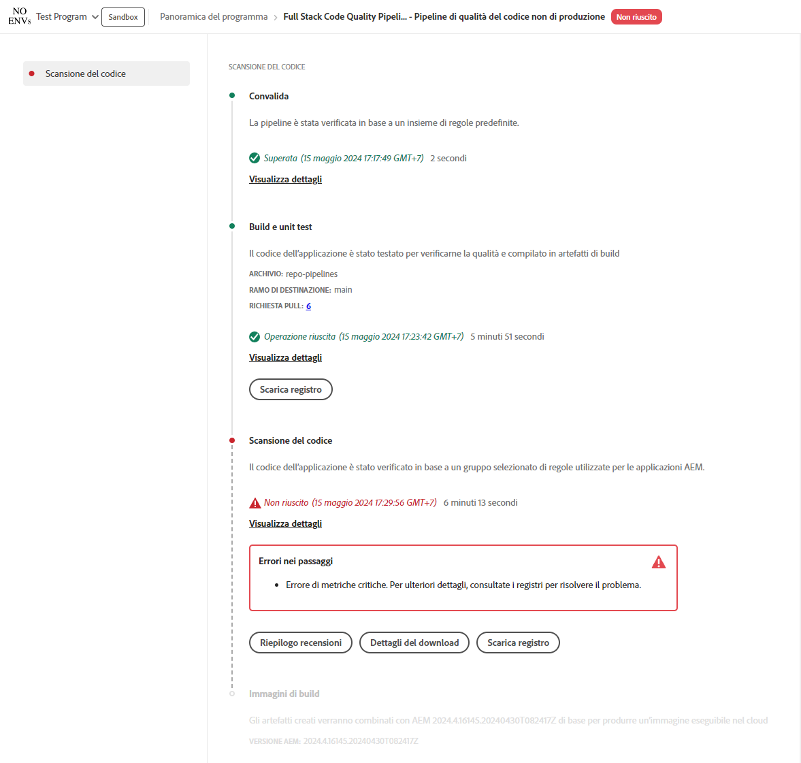

# Gestire le pipeline {#managing-pipelines}

Scopri come gestire, modificare, eseguire ed eliminare le pipeline esistenti.

## Scheda pipeline {#pipeline-card}

La scheda **Pipeline** della pagina **Panoramica del programma** in Cloud Manager offre una panoramica di tutte le pipeline e del relativo stato corrente.

Facendo clic sull&#39;icona  accanto a ciascuna pipeline, è possibile eseguire le azioni seguenti:

* [Eseguire la pipeline](#running-pipelines).
* [Modificare la pipeline](#editing-pipelines).
* [Eliminare la pipeline](#deleting-pipelines).
* [Visualizzare i dettagli](#view-details).

Nella parte inferiore dell’elenco delle pipeline sono disponibili le opzioni generali.

* **Aggiungi**: per [aggiungere una nuova pipeline di produzione](/help/using/production-pipelines.md) o [una nuova pipeline di non produzione](/help/using/non-production-pipelines.md).
* **Mostra tutto**: porta l’utente alla schermata **Pipeline** per visualizzare tutte le pipeline in una tabella più dettagliata.
* **Accesso a dati archivio**: consente di visualizzare le informazioni necessarie per accedere all’archivio Git di Cloud Manager.
* **Ulteriori informazioni**: consente di accedere alle risorse della documentazione sulla pipeline CI/CD.

## Pagina Pipeline {#pipelines}

La pagina **Pipeline** mostra un elenco completo di tutte le pipeline per il programma selezionato. Questo elenco è utile in quanto presenta informazioni più complete rispetto a quelle disponibili nella [Scheda pipeline](#pipeline-card).

1. Accedi a Cloud Manager all’indirizzo [my.cloudmanager.adobe.com](https://my.cloudmanager.adobe.com/) e seleziona l’organizzazione e il programma appropriati.

1. Nella pagina **Panoramica del programma**, fai clic sulla scheda **Pipeline** per passare alla pagina **Pipeline**.

1. Qui puoi visualizzare un elenco di tutte le pipeline del programma, nonché avviare e interrompere l’esecuzione della pipeline come faresti nella **Scheda Pipeline**.

Facendo clic sull’icona `i` vengono visualizzati i dettagli sull’ultima o attuale esecuzione della pipeline.

Facendo clic su **Visualizza dettagli**, vieni reindirizzato ai [dettagli dell’esecuzione della pipeline](#view-details).

### Contrassegnare i preferiti della pipeline{#pipeline-favorites}

Puoi contrassegnare specifiche pipeline come preferite in modo che vengano visualizzate nella parte superiore dell&#39;elenco nella pagina **Pipeline**. Questa funzionalità semplifica la ricerca e l’esecuzione delle pipeline a cui si accede di frequente.

**Per contrassegnare i preferiti della pipeline:**

1. Accedi a Cloud Manager all’indirizzo [my.cloudmanager.adobe.com](https://my.cloudmanager.adobe.com/) e seleziona l’organizzazione e il programma appropriati.
1. Dalla pagina **Panoramica programma**, fai clic sulla scheda  **Pipeline**.
1. Nella pagina **Pipeline**, a sinistra del nome e del tipo di una pipeline, fai clic su  per aggiungerla all&#39;elenco dei preferiti.
In alternativa, fai clic sull&#39;icona  per rimuovere la pipeline dall&#39;elenco dei preferiti.

## Pagina Attività {#activity}

La pagina **Attività** mostra un elenco completo di tutte le esecuzioni di pipeline per il programma selezionato.

1. Accedi a Cloud Manager all’indirizzo [my.cloudmanager.adobe.com](https://my.cloudmanager.adobe.com/) e seleziona l’organizzazione e il programma appropriati.

1. Nella pagina **Panoramica del programma**, fai clic sulla scheda **Attività** per passare alla pagina **Attività**.

1. Qui puoi visualizzare un elenco di tutte le esecuzioni della pipeline del programma, comprese le esecuzioni correnti e quelle precedenti.

Facendo clic sull’icona `i` vengono mostrati i dettagli sull’esecuzione della pipeline selezionata.

Fai clic su **Visualizza dettagli**, per rivedere i [dettagli dell’esecuzione della pipeline](#view-details).

## Eseguire una pipeline {#run-one-pipeline}

1. Accedi a Cloud Manager all’indirizzo [my.cloudmanager.adobe.com](https://my.cloudmanager.adobe.com/) e seleziona l’organizzazione e il programma appropriati.
1. Passa alla scheda **Pipeline** dalla pagina **Panoramica del programma**.
1. Fai clic sull&#39;icona  accanto alla pipeline eseguita, quindi fai clic su **Esegui**.

   La colonna Stato indica quando inizia l’esecuzione della pipeline.

   Per visualizzare i dettagli dell&#39;esecuzione, fare clic di nuovo sull&#39;icona  e fare clic su **[Visualizza dettagli](#view-details)**.

   A seconda del tipo di pipeline, è possibile annullare l&#39;esecuzione facendo nuovamente clic sull&#39;icona  e scegliendo **Annulla**.

## Eseguire più pipeline {#run-multiple-pipelines}

Con Cloud Manager è possibile eseguire più pipeline contemporaneamente, migliorando l’efficienza della distribuzione per i clienti Adobe Managed Services (AMS). La funzionalità **Esegui selezionati** consente di selezionare più pipeline e attivarle per l&#39;esecuzione simultanea. Semplifica l’esecuzione manuale delle pipeline singolarmente e ottimizza i flussi di lavoro di build e distribuzione.

**Per eseguire più pipeline:**

1. Accedi a Cloud Manager all’indirizzo [my.cloudmanager.adobe.com](https://my.cloudmanager.adobe.com/) e seleziona l’organizzazione e il programma appropriati.
1. Dal menu a sinistra, fare clic sull&#39;icona  **Pipeline**.
1. Nella tabella della pagina **Pipeline**, seleziona le caselle di controllo accanto alle pipeline da eseguire.
Se necessario, fai clic su  **Filtri** per ordinare le pipeline in base al nome, all&#39;ambiente, al tipo di codice distribuito o a una combinazione di tutte e tre.
1. Nell&#39;angolo superiore destro della pagina fare clic su **Esegui selezionato (x)**.
1. Nella finestra di dialogo **Esegui pipeline selezionate (x)**, fai clic su **Esegui (x)**.

   Il pulsante **Esegui** riflette il numero di pipeline che possono continuare. Ad esempio, potresti aver selezionato quattro pipeline, ma una è già in esecuzione. In alternativa, un ambiente collegato a una pipeline selezionata non esiste più. In tali casi, il sistema si adegua di conseguenza. Il pulsante si aggiorna a &quot;Esegui (3)&quot; per indicare che tre pipeline possono procedere.

1. Le pipeline iniziano a essere in esecuzione e il loro stato viene aggiornato nell&#39;elenco **Pipeline**.

## Modificare pipeline {#editing-pipelines}

Non è possibile modificare una pipeline in esecuzione.

**Per modificare le pipeline:**

1. Accedi a Cloud Manager all’indirizzo [my.cloudmanager.adobe.com](https://my.cloudmanager.adobe.com/) e seleziona l’organizzazione e il programma appropriati.

1. Dalla pagina **Panoramica del programma**, accedi alla scheda **Pipeline**.

1. Fai clic sull&#39;icona  accanto alla pipeline da modificare, quindi fai clic su **Modifica**.

1. Nella finestra di dialogo **Modifica pipeline di produzione** o **Modifica pipeline non di produzione** puoi modificare gli stessi dettagli immessi durante la creazione della pipeline.

   Consulta [Configurazione delle pipeline di produzione](/help/using/production-pipelines.md) e [Configurazione delle pipeline di non produzione](/help/using/non-production-pipelines.md) per informazioni dettagliate sui campi e sulle opzioni di configurazione disponibili per le pipeline.

1. Al termine, fare clic su **Aggiorna**.

## Eliminare pipeline {#deleting-pipelines}

Non è possibile eliminare una pipeline in esecuzione.

**Per eliminare le pipeline:**

1. Accedi a Cloud Manager all’indirizzo [my.cloudmanager.adobe.com](https://my.cloudmanager.adobe.com/) e seleziona l’organizzazione e il programma appropriati.

1. Dalla pagina **Panoramica del programma**, accedi alla scheda **Pipeline**.

1. Fai clic sull&#39;icona  accanto alla pipeline eseguita, quindi fai clic su **Elimina**.

## Visualizzare i dettagli della pipeline {#view-details}

È possibile visualizzare i dettagli solo per una pipeline in esecuzione o che è stata eseguita almeno una volta.

**Per visualizzare i dettagli della pipeline:**

1. Accedi a Cloud Manager all’indirizzo [my.cloudmanager.adobe.com](https://my.cloudmanager.adobe.com/) e seleziona l’organizzazione e il programma appropriati.

1. Dalla pagina **Panoramica del programma**, accedi alla scheda **Pipeline**.

1. Fai clic sull&#39;icona  accanto alla pipeline eseguita, quindi fai clic su **Visualizza dettagli**.

1. L’opzione reindirizza alla pagina dei dettagli della pipeline in esecuzione.

Da qui è possibile visualizzare lo stato dei vari passaggi della pipeline e recuperare i registri della build per finalità diagnostiche. Per ulteriori informazioni, consulta il documento [Distribuzione del codice](/help/using/code-deployment.md).

Tutti i passaggi dell’esecuzione di una pipeline vengono visualizzati con quelli non ancora avviati non selezionabili. I passaggi completati mostrano la loro durata.

Una volta completato un passaggio della pipeline, viene presentato un riepilogo.

Fai clic sul collegamento **Visualizza dettagli** per visualizzare la sezione **Durata**. Questa sezione include la durata media della pipeline in base alla tendenza storica per quel programma.

Se la pipeline conteneva un passaggio **Analisi del codice** che ha generato problemi, puoi fare clic su **Dettagli download** per visualizzare un elenco di [test di qualità del codice](/help/using/code-quality-testing.md) non superati.

Nel file CSV, una colonna **Project File Location** (Percorso file di progetto) indica dove si trova il codice in cui è stato riscontrato un problema. Questa colonna contiene un percorso relativo al progetto, mentre la colonna **File Location** (Percorso file) è generata da Maven.

