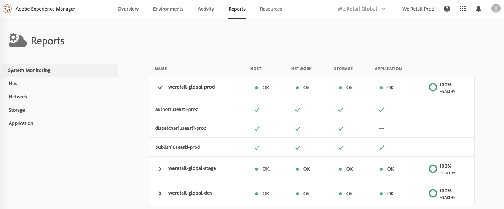
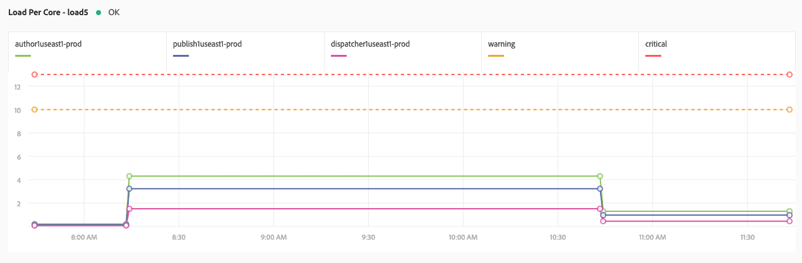

# Monitoraggio del sistema {#system-monitoring}

Il monitoraggio del sistema viene [!UICONTROL Cloud Manager] eseguito osservando le singole istanze all&#39;interno di un ambiente e monitorando diverse metriche per ogni istanza. Ciascuna metrica ha due soglie definite: una soglia *di avviso* e una soglia *critica*.

Se una metrica eccede la soglia critica, viene considerata in uno stato critico; se una metrica si trova sopra la soglia di avviso (ma sotto la soglia critica), viene considerata in stato di avviso. Le soglie sono impostate da Adobe Managed Services [!UICONTROL Cloud Manager](Servizi gestiti Adobe) e possono essere visualizzate. Nella maggior parte dei casi, le soglie sono coerenti tra i clienti, ma esistono casi in cui i servizi gestiti Adobe modificheranno soglie per soddisfare requisiti specifici del cliente. Le domande sulle soglie devono essere indirizzate al tuo Customer Success Engineer (CSE).

## Navigazione al monitoraggio del sistema {#navigating-system-monitoring}

La navigazione alla funzione Monitoraggio sistema può essere eseguita in due modi.

1. Accedi a **servizi gestiti - Programmi di** destinazione.

   

1. Fate clic sulla terza icona sulla scheda del programma.

   

   *Oppure*,

* Passate alla **pagina di destinazione Monitoraggio** del sistema tramite la **voce di menu di navigazione** globale Rapporti all&#39;interno [!UICONTROL Cloud Manager].

## Pagina Panoramica sul monitoraggio del sistema {#system-monitoring-overview-page}

La pagina Panoramica sul monitoraggio del sistema elenca gli ambienti monitorati nel programma e i rapporti sul loro livello di alto livello in quattro categorie separate:

* **Host**
* **Archiviazione**
* **Rete**
* **Applicazione**

Lo stato in ogni categoria è un riepilogo delle singole metriche; se qualsiasi metrica in una categoria è nello stato critico, l&#39;intera categoria è in uno stato critico per la pagina della panoramica. La stessa sintesi può essere visualizzata a livello di ambiente e a livello di istanza.

>[!NOTE]
>
>Per impostazione predefinita, quando si passa a questa pagina, le istanze dell&#39;ambiente di produzione sono visibili, ma anche altri ambienti.

## Dettagli sul monitoraggio del sistema {#system-monitoring-detail}

Per visualizzare i dettagli di metriche specifiche, puoi fare clic su una delle categorie nel pannello di navigazione a sinistra o fare clic su uno degli indicatori di categoria per un&#39;istanza specifica. Ogni pagina di dettaglio mostra una serie di grafici per le metriche all&#39;interno della categoria. Potete visualizzare le metriche per tutte le istanze in un ambiente o per un&#39;istanza specifica. Potete passare da un ambiente all&#39;altro utilizzando le caselle a discesa nell&#39;angolo superiore destro.

La navigazione a sinistra mostrerà le metriche disponibili nella categoria correntemente selezionata per le quali sono presenti dati per l&#39;ambiente e le istanze attualmente selezionate.

Un grafico singolo mostrerà lo stato e un grafico dei dati nel tempo insieme alle soglie. Se vengono visualizzate più istanze, i dati di ogni istanza si trovano in una serie separata.

La singola serie può essere nascosta su un grafico facendo clic sulla serie nella legenda.
Ad esempio, se si fa clic sulla serie di soglia di avviso, viene visualizzata solo la soglia critica.

### Definizioni delle metriche {#metric-definitions}

**Host**

* Carica per core: il numero di processi che vengono eseguiti dalla CPU o in uno stato di attesa media su un singolo (load 1), cinque (load 5) e un periodo di minuto di quindici (load 15).
* Conteggio processi: il numero di processi attualmente aperti.
* Conteggio utenti: numero di utenti con una sessione shell attiva.
* Uso della memoria: percentuale della memoria di sistema attualmente allocata.
* Memoria JVM (heap): le dimensioni (in Megabyte) dell&#39;Heap Java allocato.
* Spazio di generazione precedente: percentuale della memoria della vecchia generazione JVM attualmente allocata.

**Rete**

* Controllo porta CQ: Il tempo di risposta in secondi per accedere alla porta AEM o Dispatcher. Esistono metriche diverse per autore, pubblicazione e dispatcher.

**Archiviazione**

* Spazio su disco: Lo spazio su disco utilizzato (in Megabyte) per ogni punto di montaggio dell&#39;host. Esistono metriche diverse per ogni punto di montaggio. Come minimo, sono disponibili metriche per «/» e «/mnt», ma possono essere disponibili metriche di punti di montaggio aggiuntive a seconda della configurazione di istanza specifica.
* Dimensione cartella: Archivio segmenti AEM: Lo spazio su disco utilizzato (in Gigabyte) per l&#39;archivio segmenti AEM.

**Applicazione**

* Agente replica: L&#39;ora, in secondi, per un evento di replica test. Esistono metriche separate per ciascun agente di replica.
* Svuotamento del dispatcher: Numero di elementi attualmente presenti nella coda del dispatcher.

## Rapporto SLA {#sla-reporting}

I clienti sono in grado di visualizzare le prestazioni del loro ambiente di produzione AEM rispetto al contratto a livello di servizio di servizio (SLA). Questa funzione è disponibile tramite un sottomenu nella schermata Rapporti.
Ad esempio, il grafico seguente mostra il risultato mensile del SLA per 2018.

Come per i grafici di monitoraggio del sistema, se si passa su un punto dati vengono visualizzati i valori specifici per quel mese.

La sezione Analisi evento di questo grafico mostra il set di incidenti verificatisi per il programma durante l&#39;anno selezionato. Ogni incidente ha un intervallo di tempo, una causa e un insieme di commenti.

## Metriche SLA {#sla-metrics}

* **Autore autore**: Si tratta del SLA definito nel tuo contratto con i servizi gestiti Adobe per il livello di authoring.

* **SLA Author Author**: Questa è la misura più aggiornata degli incidenti di factoring di livello di creazione di produzione causati da Adobe o dai nostri fornitori.

* **SLA autore**: Questo è il tempo di ingrandimento del livello di authoring che ignorerà il tempo di inattività pianificato, ad esempio le finestre di manutenzione.

* **Contratto utente finale**: Si tratta del SLA definito nel tuo contratto con i servizi gestiti Adobe per il livello di pubblicazione.

* **SLA utente finale di AMS**: Questo è il tempo misurato degli incidenti di factoring di livello pubblicazione di produzione causati da Adobe o dai nostri fornitori.

* **SLA utente finale**: Questo è il tempo di pubblicazione del livello di pubblicazione che ignorerà il tempo pianificato, ad esempio le finestre di manutenzione.