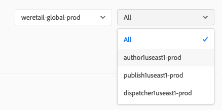

# Monitoraggio del sistema {#system-monitoring}

Il monitoraggio del sistema in [!UICONTROL Cloud Manager] viene eseguito osservando le singole istanze all&#39;interno di un ambiente e monitorando una varietà di metriche per ogni istanza. Ogni metrica dispone di due soglie definite: una *soglia di avviso* e una *soglia critica*.

Se una metrica supera la sua soglia critica, è considerata in uno stato critico; se una metrica supera la soglia di avviso (ma è al di sotto della soglia critica), viene considerata come in uno stato di avviso. Le soglie sono impostate da Adobe Managed Services e possono essere visualizzate in [!UICONTROL Cloud Manager]. Nella maggior parte dei casi, le soglie sono coerenti tra i clienti, ma in alcuni casi Adobe Managed Services modificherà le soglie in base a specifiche esigenze dei clienti. Le domande sulle soglie devono essere indirizzate al tuo Customer Success Engineer (CSE).

## Navigazione al monitoraggio del sistema {#navigating-system-monitoring}

La navigazione alla funzione di monitoraggio del sistema può essere eseguita in due modi.

1. Accedi alla pagina di destinazione **Managed Services - Programmi**.

   

1. Fai clic sulla quarta icona sulla scheda del programma.

   

   *Oppure*,

* Passa alla pagina di destinazione **Monitoraggio sistema** attraverso la voce di menu di navigazione globale **Reports** all’interno di [!UICONTROL Cloud Manager].

## Pagina Panoramica del monitoraggio del sistema {#system-monitoring-overview-page}

Nella pagina Panoramica del monitoraggio del sistema sono elencati gli ambienti monitorati nel programma e vengono forniti rapporti sullo stato di salute di alto livello in quattro diverse categorie:

* **Host**
* **Archiviazione**
* **Rete**
* **Applicazione**

Lo stato in ogni categoria è un riepilogo delle singole metriche. Se una metrica in una categoria si trova nello stato critico, l’intera categoria si trova in uno stato critico ai fini della pagina di panoramica. Lo stesso riepilogo può essere visualizzato a livello di ambiente e di istanza.

>[!NOTE]
>
>Per impostazione predefinita, quando si passa a questa pagina, le istanze dell’ambiente di produzione sono visibili, ma è possibile aprire anche altri ambienti.

## Tutorial video {#video-tutorial}

### Panoramica dei report di Cloud Manager {#reports-video}

I rapporti di Cloud Manager forniscono una visualizzazione degli ambienti e delle istanze AEM del programma tramite un set di grafici che generano rapporti e tengono traccia di una varietà di metriche per ogni istanza AEM.
Per ulteriori informazioni, fai riferimento al video seguente.

>[!VIDEO](https://video.tv.adobe.com/v/26315/)

## Dettagli sul monitoraggio del sistema {#system-monitoring-detail}

Per visualizzare i dettagli di metriche specifiche, puoi fare clic su una delle categorie nella navigazione a sinistra oppure fare clic su uno degli indicatori di categoria per una specifica istanza. Ogni pagina di dettaglio mostra una serie di grafici per le metriche all’interno di tale categoria. Puoi visualizzare le metriche per tutte le istanze in un ambiente o per un&#39;istanza specifica. Puoi passare dall’ambiente alle istanze utilizzando le caselle a discesa nell’angolo in alto a destra.

Nella navigazione a sinistra vengono visualizzate le metriche disponibili all’interno della categoria attualmente selezionata per la quale sono presenti dati per l’ambiente e le istanze selezionati.

Un singolo grafico mostra lo stato e un grafico dei dati nel tempo insieme alle soglie. Se vengono visualizzate più istanze, i dati di ciascuna istanza saranno su una serie separata.

Le singole serie possono essere nascoste su un grafico facendo clic sulla serie nella legenda.
Ad esempio, se fai clic sulla serie di soglie di avviso, visualizzerai solo la soglia critica.

### Definizioni delle metriche {#metric-definitions}

**Host**

* Carico per core: il numero di processi che vengono eseguiti dalla CPU o che si trovano in uno stato di attesa medio su un periodo di uno (carico1), cinque (carico5) e quindici (carico15) minuti.
* Conteggio processi: il numero di processi attualmente aperti.
* Conteggio utenti: il numero di utenti con una sessione shell attiva.
* Utilizzo della memoria: la percentuale di memoria di sistema attualmente allocata.
* Memoria JVM (heap): la dimensione (in megabyte) del Java Heap allocato.
* Spazio di vecchia generazione: la percentuale di memoria di generazione precedente JVM attualmente allocata.

**Rete**

* Controllo porta CQ: Tempo di risposta in secondi per accedere alla porta AEM o Dispatcher. Esistono diverse metriche per l’autore, la pubblicazione e il dispatcher.

**Archiviazione**

* Spazio su disco: Lo spazio su disco utilizzato (in Megabyte) per ogni punto di montaggio sull&#39;host. Esistono diverse metriche per ogni punto di montaggio. Puoi visualizzare almeno le metriche per &quot;/&quot; e &quot;/mnt&quot;, ma potrebbero essere disponibili metriche aggiuntive relative ai punti di montaggio a seconda della configurazione specifica dell’istanza.
* Dimensioni cartella: Archivio segmenti AEM: Lo spazio su disco utilizzato (in Gigabyte) per l&#39;archivio segmenti AEM.

**Applicazione**

* Agente di replica: Tempo, in secondi, per un evento di replica di prova. Esistono metriche separate per ogni agente di replica.
* Flush del dispatcher: Il numero di elementi attualmente nella coda di scaricamento del dispatcher.

## Rapporti SLA {#sla-reporting}

I clienti possono vedere le prestazioni del proprio ambiente di produzione AEM rispetto al contratto di assistenza (SLA, Service Level Agreement). È disponibile tramite un sottomenu nella schermata Rapporti .
Ad esempio, il grafico seguente mostra il raggiungimento mensile dello SLA per il 2018.

Come per i grafici di monitoraggio del sistema, il passaggio in un punto dati mostra i valori specifici per quel mese.

La sezione Analisi eventi sotto questo grafico mostra l&#39;insieme di incidenti verificatisi per il programma durante l&#39;anno attualmente selezionato. Ogni incidente ha un intervallo di tempo, una causa e una serie di commenti.

## Metriche SLA {#sla-metrics}

* **Contratto** autore: Si tratta dello SLA definito nel contratto con Adobe Managed Services per il livello di authoring.

* **SLA** autore AMS: Questo è il tempo di attività misurato degli incidenti di factoring del livello di authoring di produzione causati da Adobi o nostri fornitori.

* **Autore SLA**: Questo è il tempo di attività misurato del livello di authoring che ignora i tempi di inattività pianificati, come le finestre di manutenzione.

* **Contratto** con l&#39;utente finale: Si tratta dello SLA definito nel contratto con Adobe Managed Services per il livello di pubblicazione.

* **SLA** per gli utenti finali AMS: Questo è il tempo di attività misurato degli incidenti di factoring del livello di pubblicazione della produzione causati da Adobe o nostri fornitori.

* **SLA** utente finale: Questo è il tempo di attività misurato del livello di pubblicazione ignorando i tempi di inattività pianificati, come le finestre di manutenzione.