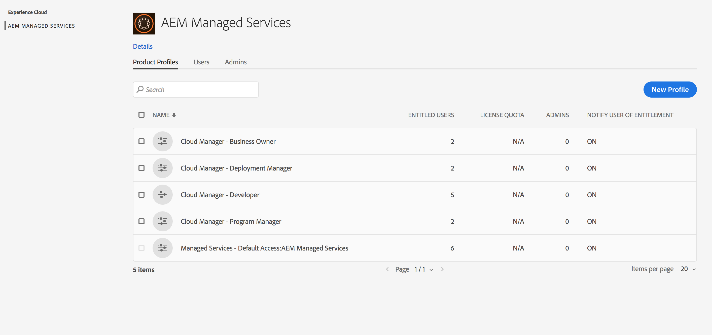

# Configurazione delle configurazioni generali [!UICONTROL Cloud Manager]{#setting-up-general-configurations-for-cloud-manager}

Nella sezione seguente sono illustrati i prerequisiti per configurare [!UICONTROL Cloud Manager] e gestire i contenuti dalla propria interfaccia utente.

In questa pagina vengono trattati i seguenti argomenti

* **Configurazione di utenti e ruoli**
* **Configurazione progetto applicazione AEM**
* **Configurazioni del dispatcher**
* **Best practice per lo sviluppo**

Nel diagramma seguente sono illustrate le diverse funzioni che consentono [!UICONTROL Cloud Manager] di fornire continuamente codice di qualità migliore:


## Configurazione di utenti e ruoli {#setting-up-users-and-roles}

I ruoli vengono gestiti da [!UICONTROL Cloud Manager] Adobe Admin Console. Le iscrizioni di ruolo specifiche vengono fornite aggiungendo l&#39;utente a un [!UICONTROL Cloud Manager] profilo di prodotto in Admin Console.

>[!CAUTION]
>
>Per utilizzare [!UICONTROL Cloud Manager], devi avere un Adobe ID e il contesto prodotto Servizi gestiti Adobe.

Puoi assegnare specifiche appartenenze di ruolo aggiungendo l&#39;utente a un [!UICONTROL Cloud Manager] profilo di prodotto in Admin Console.

Crea i seguenti ruoli tramite Admin Console per [!UICONTROL Cloud Manager]:

>[!NOTE]
>
>Adobe Admin Console fornisce una posizione centrale per la gestione delle adesioni Adobe nell&#39;intera organizzazione.
>
>Per ulteriori informazioni su Adobe Admin Console, consulta la documentazione di [Admin Console](https://helpx.adobe.com/enterprise/using/admin-console.html).

| **[!UICONTROL Cloud Manager]Ruoli** | **Descrizione** |
|---|---|
| Proprietario aziendale | Responsabile della definizione dei KPI, approvazione di implementazioni di produzione e sostituzione di importanti errori a 3 gradi. |
| Program Manager | Utilizza [!UICONTROL Cloud Manager] per eseguire l&#39;impostazione del team, lo stato di revisione e i KPI. Potrebbe approvare importanti errori a 3 gradi. |
| Gestione distribuzione | Gestisce le operazioni di distribuzione. Utilizza [!UICONTROL Cloud Manager] per eseguire distribuzioni di fase/produzione. Potrebbe approvare importanti errori a 3 gradi. Ha accesso a Git. |
| Sviluppatore | Sviluppa e verifica il codice dell&#39;applicazione personalizzato. Viene utilizzato [!UICONTROL Cloud Manager] principalmente per visualizzare lo stato. Consente di accedere a Git. |
| Customer Success Engineer | In genere supporta il successo dei clienti per i clienti AMS. Interagisce con [!UICONTROL Cloud Manager] allo scopo di eseguire distribuzioni che richiedono la supervisione CSE. |
| Autore contenuto | In genere non interagisce [!UICONTROL Cloud Manager]con. Può utilizzare [!UICONTROL Cloud Manager] il commutatore di programmi (da [!UICONTROL Experience Cloud]) per accedere a AEM. |

### Utilizzo di Admin Console per configurare il team {#using-admin-console-to-set-up-team}

Per fornire le autorizzazioni appropriate basate su ruoli agli [!UICONTROL Cloud Manager] utenti, un amministratore nell&#39;organizzazione del cliente deve creare nuovi profili di prodotto in Contesto [!UICONTROL AEM Managed Services] prodotto.

>[!NOTE]
>
>Per accedere ad admin console e configurare il team (utenti e ruoli), aprite un browser e visitate [https://adminconsole.adobe.com](https://adminconsole.adobe.com/enterprise).

L&#39;aggiunta di utenti (o gruppi) a questi profili di prodotto avviene utilizzando la normale funzionalità Admin Console, come illustrato nella figura seguente:

1. Accedi ad Admin Console e fai clic su **Nuovo profilo** per aggiungere un nuovo profilo.

   

1. Fill in the fields to set up a new role for [!UICONTROL Cloud Manager].

   Immettete **Nome profilo**, **Descrizione** per creare un nuovo profilo. Inoltre, potete selezionare un **gruppo di autorizzazioni** per il profilo.

   Fai clic su **Fine** per completare il passaggio di creazione del profilo.

   

## Configurazione progetto applicazione AEM {#aem-application-project-setup}

Prima di impostare il progetto dell&#39;applicazione in [!UICONTROL Cloud Manager], dovrete considerare uno dei due scenari. Potresti essere di nuovo in AEM 6.4 oppure essere già un cliente esistente.

>[!NOTE]
>
>Per poter accedere a [!UICONTROL Cloud Manager], contatta gli ingegneri Customer Success Engineers (CSE) per ottenere l&#39;URL e le credenziali per iniziare.

Potete configurare un progetto applicazione per [!UICONTROL Cloud Manager], in base ai due scenari seguenti:

* **Nuovo progetto AEM**:

Un nuovo progetto AEM sfrutterà il progetto esistente e funzionerà [!UICONTROL Cloud Manager].

Per ulteriori informazioni, consultate [Guida introduttiva ad AEM 6.4](https://chl-author./content/help/en/experience-manager/6-4/sites/deploying/using/deploy.html). Inoltre, consulta Risorse [AEM](https://www.adobe.com/marketing-cloud/experience-manager/resources.html?promoid=759X6WV8&mv=other) per ulteriori informazioni.

* **Progetto AEM esistente**:

Un progetto AEM esistente deve confermare la configurazione delle regole. Potete aggiornare l&#39;installazione esistente di AEM per ottenere nuove funzionalità e miglioramenti offerti in AEM 6.4 e iniziare a utilizzare [!UICONTROL Cloud Manager]. Questi criteri dovrebbero funzionare con modifiche minime. Contattate gli ingegneri Customer Success Engineers (CSE) per il supporto.

Per informazioni aggiuntive su come aggiornare l&#39;istanza di AEM a 6.4, consultate [Aggiornamento ad AEM 6.4](https://helpx.adobe.com/experience-manager/6-4/sites/deploying/using/upgrade.html).

### Impostazione dell&#39;archivio {#setting-up-repository}

A single, initially empty, git repository is provisioned for each program onboarded in [!UICONTROL Cloud Manager]. Gli sviluppatori e i manager di distribuzione vengono forniti con l&#39;URL git e le credenziali del loro CSE.

Con queste informazioni, uno sviluppatore può aggiungere il proprio codice seguendo le linee guida in** Project Configurup** nella sezione di seguito, per completare i requisiti di configurazione prima di utilizzare [!UICONTROL Cloud Manager].

## Configurazioni del dispatcher {#dispatcher-configurations}

[!UICONTROL Cloud Manager] è in grado di distribuire i file di configurazione del server Web e del dispatcher, purché siano memorizzati nell&#39;archivio git, oltre ai normali pacchetti di contenuto AEM.

Per sfruttare questa funzionalità, la build Maven genera un file zip contenente due directory: ***conf*** e ***conf. d***.

Dopo la distribuzione a un&#39;istanza di dispatcher, il contenuto di queste directory sovrascrive il contenuto di queste directory nell&#39;istanza di dispatcher. Poiché i file di configurazione del server Web e di dispatcher richiedono frequentemente informazioni specifiche sull&#39;ambiente, per utilizzare correttamente questa funzionalità dovrai prima collaborare con i loro ingegneri Customer Success Engineers (CSE) per estrarre queste variabili d&#39;ambiente in /etc/sysconfig/httpd.

Per completare il processo iniziale nella configurazione del dispatcher, effettuate le seguenti operazioni:

1. Ottenete i file di configurazione di produzione correnti dal loro CSE.
1. Rimuovi dati per l&#39;ambiente hardcoded (ad es. per pubblicare IP di rendering) e sostituirli con le variabili.
1. Definite le variabili richieste in coppie chiave-valore per ciascun dispatcher di destinazione e richiede CSE da aggiungere a ***/etc/sysconfig/httpd*** in ciascuna istanza.
1. Sottoponete a test le configurazioni aggiornate sullo stage, quindi richiedete CSE alla distribuzione in produzione per assicurare che funzionino correttamente.
1. Salvate i file su Git.
1. Distribuisci tramite [!UICONTROL Cloud Manager].

Il file zip effettivo può essere prodotto utilizzando il plug-in maven-assembly. I progetti generati mediante il modello Multimodule AEM di Lazybones possono disporre della struttura di progetto Maven corretta creata come parte della creazione di progetti.

>[!NOTE]
>
>La configurazione del dispatcher viene effettuata durante l&#39;accesso, [!UICONTROL Cloud Manager]ma può anche essere eseguita in un secondo momento.

### Configurazione del dispatcher per test prestazioni {#configuring-dispatcher-for-performance-testing}

Per eseguire [!UICONTROL Cloud Manager] correttamente i test delle prestazioni, il server di dispatcher dell&#39;area di visualizzazione deve rispondere agli stessi nomi host del dispatcher di produzione in modo coerente con il server di produzione.

*Ad esempio*, se un cliente include [www.myco.com](http://www.myco.com/) e [www.myotherco.com](http://www.myotherco.com,/) come nomi host di produzione e stage-myco. adobecqms. net come nome host dell&#39;area di visualizzazione, una richiesta come questa deve rispondere correttamente:

```
curl -H"Host: www.myco.com" http://stage-myco.adobecqms.net/en/home.html
```

Questo richiede non solo che i nomi degli host siano configurati correttamente nella configurazione di dispatcher, ma anche che ***/etc/map***, qualsiasi riscrittura Apache o un&#39;altra regola ***di mappatura/filtro*** del percorso siano implementati in modo coerente tra l&#39;area di visualizzazione e la produzione.

## Best practice per lo sviluppo {#development-best-practices}

Prima di utilizzare [!UICONTROL Cloud Manager], è consigliabile comprendere alcune best practice per configurare il progetto e configurare la configurazione di un server Web o di una sfumatura.

### Configurazione progetti {#project-set-up}

I progetti devono aderire ad alcuni criteri per lavorare [!UICONTROL Cloud Manager]con.

Seguite le procedure ottimali per configurare i progetti in [!UICONTROL Cloud Manager]:

* L&#39;unico strumento di build fornito e supportato è Apache Maven. Apache Maven 3.3.9 è installato.
* Le build vengono eseguite in un ambiente Linux in un contenitore Docker come utente principale.
* La versione Java installata è Oracle JDK 8 u 161.
* Sono installati altri pacchetti di sistema come, ad esempio, bzip 2, unzip, libpng, imagemagick e graphicsmagick. Se avete bisogno di altri pacchetti, dovrete richiederli tramite il CSE.
* Maven viene sempre eseguito con il comando mvn -b clean.
* Viene fornito un repository git completo. Nella directory principale di questa directory archivio deve essere presente un file pom.xml. Questo file pom.xml può fare riferimento a tanti sottomoduli (che a loro volta possono avere altri sottomoduli, ecc.) se necessario, ma deve essere presente un solo punto di ingresso.
* Maven è configurato a livello di sistema con un file settings.xml che include automaticamente l&#39;archivio artefatto pubblico di Adobe (repo.adobe.com).
* Nei file pom.xml potete aggiungere altri archivi. Tuttavia, l&#39;accesso a archivi artefatti protetti da password o protetti da rete non è supportato.
* I pacchetti di contenuto implementabili vengono scoperti mediante la scansione dei file ZIP contenuti in una directory denominata destinazione. Anche in questo caso, qualsiasi numero di sottomoduli potrebbe produrre pacchetti di contenuto.
* Se sono presenti più pacchetti di contenuto, l&#39;ordine delle distribuzioni del pacchetto non è garantito. Qualora sia necessario un ordine specifico, per definire l&#39;ordine sarà possibile utilizzare dipendenze del pacchetto di contenuto.

<!-- 

Comment Type: annotation
Last Modified By: jsyal
Last Modified Date: 2018-05-02T18:18:15.028-0400

change as per KT

 -->

### Passaggi successivi {#the-next-steps}

Una volta configurate le configurazioni generali, è possibile utilizzarle [!UICONTROL Cloud Manager].

Fate riferimento [a Utilizzo [! UICONTROL Cloud Manager]](https://helpx.adobe.com/experience-manager/cloud-manager/using/using-cloud-manager.html) per iniziare a utilizzare [!UICONTROL Cloud Manager].
