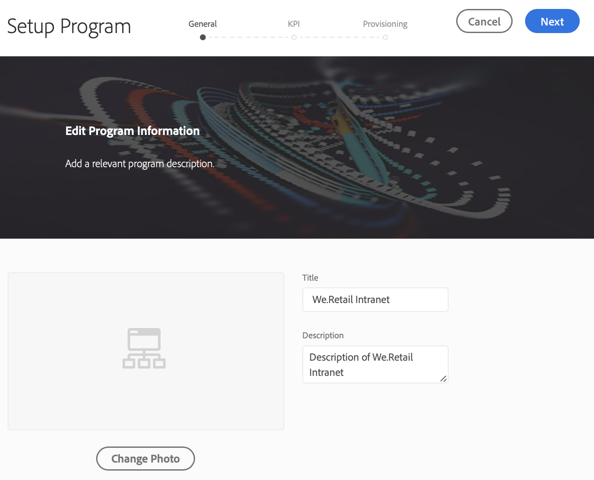
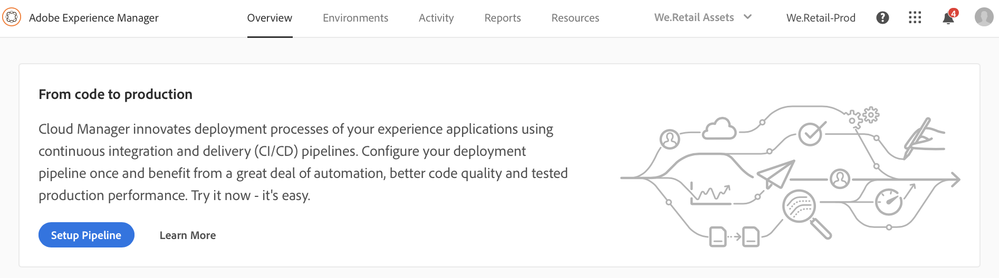
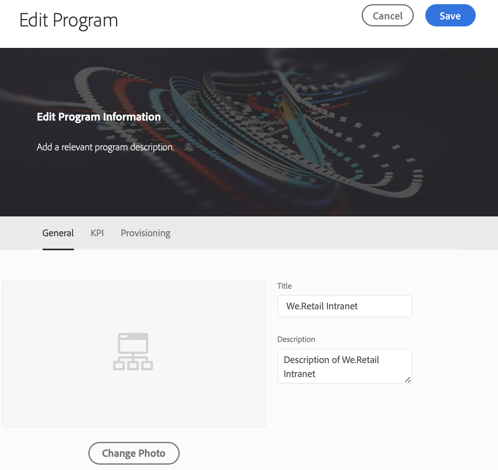

# Configurare il programma {#setup-your-program}

Dopo l&#39;imbarco, il proprietario dell&#39;azienda dovrà completare una configurazione iniziale del programma. Ciò comporta l’impostazione della descrizione del programma e la definizione degli indicatori prestazioni chiave (KPI, Key Performance Indicators) che verranno utilizzati per il test delle prestazioni. Facoltativamente, è possibile caricare una miniatura. Inoltre, il proprietario aziendale può configurare il provisioning degli ambienti durante la configurazione del programma.

I KPI definiti fungono da linea di base per i test delle prestazioni che vengono trasmessi ogni volta che la pipeline viene eseguita.

>[!NOTE]
>
>I KPI definiti vengono misurati sui test eseguiti nell&#39;ambiente **stage** . In genere, questi KPI vengono ridimensionati per adattarsi alle funzionalità dell’ambiente stage.
>
>Ad esempio, se un utente si aspetta una media di 1000 visualizzazioni di pagina al minuto nella propria produzione **Ambiente** e dispone di quattro server di produzione dispatcher/pubblicazione, questo dovrebbe essere scalato a 250 visualizzazioni di pagina al minuto (supponendo che l’ambiente di stage sia costituito da una sola coppia di server dispatcher/publish).
>
>Inoltre, molti utenti disporranno di una rete CDN (Content Delivery Network), come Akamai o CloudFront, davanti al proprio ambiente di produzione. Poiché [!UICONTROL Cloud Manager] esegue direttamente il test sull’ambiente di stage, l’indicatore KPI deve riflettere solo il traffico previsto attraverso la rete CDN, ovvero la cache mancante. In genere si tratta di un sottoinsieme relativamente piccolo del traffico di produzione totale.

## Utilizzo di [!UICONTROL Cloud Manager] per configurare il programma {#using-cloud-manager-to-setup-your-program}

Per impostare il programma e definire i KPI, effettua le seguenti operazioni:

1. Fai clic su **Programma di installazione** per avviare il processo di configurazione in [!UICONTROL Cloud Manager].

   

   >[!NOTE]
   > Puoi sempre cambiare, modificare o aggiungere un nuovo programma dalla barra delle azioni, come illustrato nella figura riportata di seguito.

   

1. Nella schermata **Programma di installazione** vengono visualizzate le informazioni sul programma di modifica.

1. Verranno visualizzate tre opzioni come la scheda **Generale**, **KPI** e **Provisioning** .

1. Nella scheda **Generale** , carica una miniatura nel programma. È inoltre possibile aggiungere una descrizione pertinente al programma.

   

1. In **KPI** puoi definire i due KPI (aspettative per ogni implementazione). Sono definiti KPI separati per **AEM Sites** e **AEM Assets**. Potrai specificare i KPI per i prodotti per i quali hai concesso la licenza.

   **AEM Sites**

   1. Qual è il tempo di risposta del 95° percentile accettabile per te?

      * Valore consigliato - 3 secondi
   1. Quante visualizzazioni di pagina al minuto al di sotto del carico di picco?

      * Valore consigliato - 200 visualizzazioni di pagina al minuto

   **AEM Assets**

   Dalla versione iniziale, Cloud Manager è stato in grado di eseguire test delle prestazioni per i programmi AEM Sites. A partire da questa versione, è stata aggiunta la possibilità di eseguire test delle prestazioni anche per i programmi AEM Assets. Il test delle prestazioni delle risorse viene eseguito caricando ripetutamente le risorse durante un periodo di test di 30 minuti e misurando il tempo di elaborazione per ciascuna risorsa e varie metriche a livello di sistema.
Durante l’impostazione del programma, vengono specificati i KPI specifici per le risorse:

   * 95° tempo di elaborazione percentuale
   * Risorse caricate al minuto

   

1. In **Provisioning** è possibile visualizzare o modificare la configurazione di provisioning per gli ambienti di produzione e non di produzione nel programma. Se è stata attivata la scalabilità automatica per il programma, verrà visualizzato **La scalabilità automatica è attiva**.

   >[!NOTE]
   >
   >* La funzione di scalabilità automatica è applicabile solo all’ambiente di produzione e potrebbe non essere disponibile per tutti i programmi dei clienti.
   >* Il ridimensionamento su richiesta non è disponibile per questa versione di [!UICONTROL Cloud Manager].

   

1. Fai clic su **Salva** per completare la procedura guidata di installazione.

   >[!NOTE]
   >
   >È sempre possibile modificare il programma una volta che il programma iniziale è già stato impostato. Per ulteriori informazioni, segui i passaggi riportati di seguito.

## Modifica di un programma

1. Passa alla soluzione nella schermata principale **Cloud Manager**.

   

1. Seleziona la soluzione e fai clic su **Modifica** per aggiornare o modificare il programma, come illustrato nella figura riportata di seguito.

   

1. Viene visualizzata la schermata **Modifica programma** che consente di aggiornare o modificare il programma.

   

## Passaggi successivi {#the-next-steps}

Se hai già configurato la **pipeline**, l&#39;esecuzione successiva terrà conto delle impostazioni aggiornate. Se non hai ancora configurato la pipeline, segui prima i passaggi per configurarla.

Per configurare la pipeline, consultate [Configurare la pipeline CI/CD](https://helpx.adobe.com/experience-manager/cloud-manager/using/configuring-pipeline.html) .
