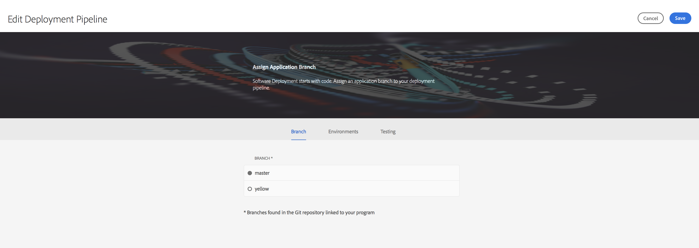
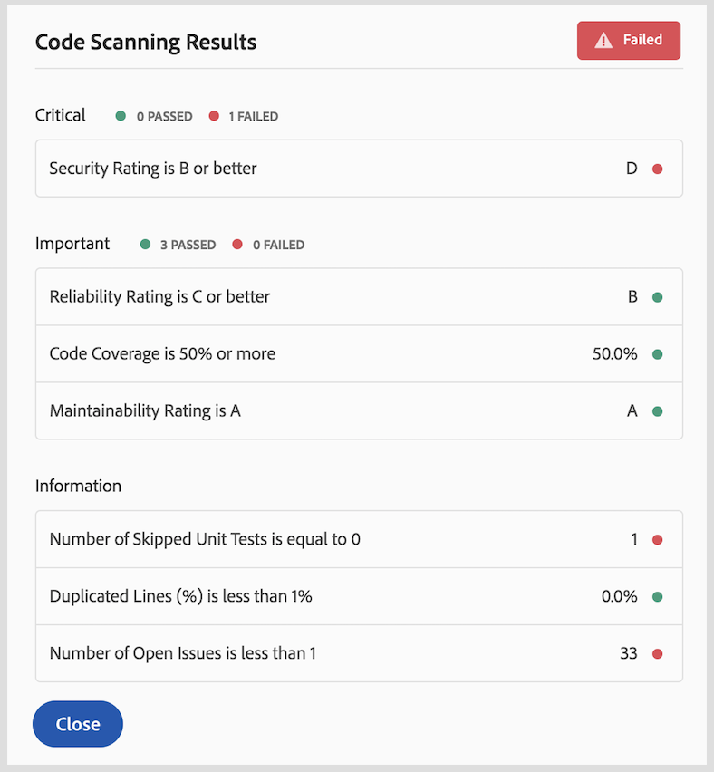

# Utilizzo di Cloud Manager{#using-cloud-manager}

Questa sezione descrive l&#39;interfaccia utente (interfaccia utente) per [!UICONTROL Cloud Manager] e spiega il flusso di lavoro dall&#39;impostazione del programma alla distribuzione del codice seguito da verifiche di qualità.

## Prerequisiti {#prerequisites}

Prima di accedere ai dettagli relativi all&#39;utilizzo, [!UICONTROL Cloud Manager]si consiglia di effettuare le seguenti operazioni:

* [Comprendere i concetti prima di utilizzare [! UICONTROL Cloud Manager]](understanding-concepts.md)
* [Configurazione delle configurazioni generali per [! UICONTROL Cloud Manager]](setting-configurations-for-cloud-manager.md)

## Guida introduttiva [!UICONTROL Cloud Manager]{#getting-started-with-cloud-manager}

Una volta configurate le configurazioni generali per [!UICONTROL Cloud Manager], è possibile utilizzare [!UICONTROL Cloud Manager].

1. Accedi ad Adobe [!UICONTROL Experience Cloud] per visualizzare l&#39;elenco delle soluzioni.

   

1. Selezionate il programma e fate clic sull&#39;icona in alto a sinistra per aprirlo [!UICONTROL Cloud Manager].

   

## Impostazione del programma {#setting-up-program}

Dopo l&#39;iscrizione, il proprietario aziendale dovrà effettuare una configurazione iniziale del programma. Ciò richiede l&#39;impostazione della descrizione del programma e la definizione dei KPI che verranno utilizzati per il test delle prestazioni. È possibile caricare una miniatura.

I KPI definiti fungono da linea di base per il test delle prestazioni che vengono trasmesse ogni volta che la pipeline viene eseguita.

>[!NOTE]
>
>I KPI definiti sono misurati sui test eseguiti nell&#39;ambiente **dell&#39;area di visualizzazione** . In genere, questi KPI vengono ridotti in base alle capacità dell&#39;ambiente dell&#39;area di visualizzazione.
>
>Ad esempio, un utente prevede una media di 1000 visualizzazioni di pagina al minuto nel relativo ambiente di produzione e la presenza di quattro `dispatcher/publish` server in produzione dovrebbe ridimensionare questo a 250 visualizzazioni di pagina al minuto (supponendo che l&#39;ambiente dello stage sia costituito da una sola coppia `dispatcher/publish` di server).
>
>Inoltre, molti utenti avranno una rete CDN (Akamai, cloudfront) davanti al loro ambiente di produzione. Poiché [!UICONTROL Cloud Manager] i test avvengono direttamente nell&#39;ambiente dell&#39;area di visualizzazione, la KPI deve riflettere solo il traffico previsto per passare attraverso la rete CDN, vale a dire la cache. In genere si tratta di un sottoinsieme relativamente piccolo del traffico di produzione totale.

### Utilizzo [!UICONTROL Cloud Manager] per definire i KPI {#using-cloud-manager-to-define-kpis}

Per configurare il programma e definire i KPI, effettuate le seguenti operazioni:

1. Click **Setup Program** to start the setup process in [!UICONTROL Cloud Manager].
1. Viene visualizzata la schermata **Modifica informazioni** programma.

   Caricate una miniatura nel programma. Potete anche aggiungere una descrizione pertinente al programma e fare clic **su Avanti**.

1. Viene visualizzata la schermata **Configura utenti** .

   Potete configurare i ruoli del team e gli utenti. Fai clic su **Avanti**.

1. Viene visualizzata la **schermata Configura KPI** General Business.

   Potete definire i due KPI (aspettative per ogni distribuzione):

   1. Qual è il 95 ° tempo di risposta percentile accettabile?

      1. Valore consigliato - 3 secondi
   1. Quante visualizzazioni di pagina al minuto sono sotto il caricamento del picco?

      1. Valore consigliato - 200 pv/m


1. Fate clic su **Invia** per completare la procedura guidata di configurazione.

   Verrà visualizzata la schermata principale per [!UICONTROL Cloud Manager] la modifica di **Distribuzione**.

## Ambienti disponibili {#available-environments}

Gli ambienti **disponibili** negli [!UICONTROL Cloud Manager] elenchi sono elencati in tutti gli ambienti AEM gestiti.

A ciascun ambiente elencato viene associato uno stato.

## Configurazione della pipeline {#configuring-pipeline}

### Configurazione della pipeline {#setting-up-pipeline}

>[!CAUTION]
>
>La pipeline non può essere impostata finché l&#39;archivio git non avrà almeno un ramo.

Prima di iniziare a distribuire il codice, devi configurare le impostazioni della pipeline dall &#39; [!UICONTROL Cloud Manager].

Per ulteriori informazioni sulla configurazione della pipeline, consultate **la sezione Panoramica** della pipeline in** [Understanding Concepts before Using [! UICONTROL Cloud Manager]](understanding-concepts.md)**.

>[!NOTE]
>
>Potete modificare le impostazioni della pipeline dopo l&#39;impostazione iniziale.

### Configurazione delle impostazioni della pipeline dal pannello [!UICONTROL Cloud Manager]{#configuring-pipeline-settings-from-the-cloud-manager}

Segui i passaggi seguenti dalla [!UICONTROL Cloud Manager] sezione per configurare i token e le preferenze per la tua pipeline:

1. Accedere alla **scheda Ramo** per impostare il ramo dell&#39;applicazione.

   Selezionare il ramo git che si desidera impostare.

   >[!NOTE]
   >
   >I rami presenti nell&#39;archivio Git sono collegati al programma.

   

1. Accedere alla scheda **Ambienti** per selezionare le opzioni **relative all&#39;area di visualizzazione** e **alla produzione** .

   Potete definire trigger che avvia la pipeline:

   * **Manuale** : un utente deve fare clic manualmente nell&#39;interfaccia per avviare la pipeline.
   Ora definite i parametri che controllano la distribuzione di produzione. Le tre opzioni disponibili sono le seguenti:

   * **Usa approvazione dal vivo**- Una distribuzione deve essere approvata manualmente da un proprietario aziendale, un manager progetto o un manager distribuzione tramite l&#39; [!UICONTROL Cloud Manager] interfaccia utente.
   * **Utilizzo della Supervisione** CSE - Un CSE è coinvolto per avviare la distribuzione.
   

1. Accedete alla **scheda Test** per definire i criteri di verifica per il programma.

   Ora potete configurare i parametri di test delle prestazioni.

   

## Distribuzione del codice {#deploying-code}

Dopo aver configurato la pipeline (archivio, ambiente e ambiente di test), puoi distribuire il codice.

### Distribuzione del codice da [!UICONTROL Cloud Manager]{#deploying-code-from-cloud-manager}

Segui i passaggi indicati di seguito per distribuire il codice nell&#39;ambiente di produzione:

1. Fate clic su **Distribuisci** dall&#39; [!UICONTROL Cloud Manager] avvio per avviare il processo di distribuzione.
1. Viene visualizzata **la schermata Distribuzione** dell&#39;area di visualizzazione.

   Fate clic su **Genera** per avviare il processo.

1. Il processo completo di build prende in considerazione diversi parametri per controllare e distribuire il codice.

   I seguenti parametri sono controllati:

   **Distribuzione dell&#39;area di visualizzazione**

   * Archivio
   * Test di unità
   * Scansione codice
   * Implementato nell&#39;ambiente Stage
   **Test preproduzione**

   * Test di sicurezza
   * Test delle prestazioni
   >[!NOTE]
   >
   >Inoltre, potete visualizzare i registri o rivedere i risultati per i criteri di verifica indicati sopra.

## Risultati della verifica della qualità {#results-from-quality-checks}

La pipeline contiene tre gate: Qualità del codice, Test delle prestazioni e testing di sicurezza.

Per ciascuno di questi gate, esiste una struttura a tre gradi per i problemi identificati dal gate.

* **Critical** - These are issues identified by the gate which cause an immediate failure of the pipeline.
* **Importante** : questi sono problemi identificati dal gate che provocano la messa in pausa della pipeline. Un manager distribuzione, un manager progetto o un proprietario aziendale può ignorare i problemi, nel qual caso la pipeline procede oppure possono accettare i problemi, nel qual caso la pipeline si interrompe con un errore.
* **Informazioni** : sono problemi identificati dal gate che sono forniti esclusivamente a scopo informativo e non hanno alcun impatto sull&#39;esecuzione della pipeline.

### Scansione codice {#code-scanning}



### Test delle prestazioni {#performance-testing}

*I test delle prestazioni* vengono [!UICONTROL Cloud Manager] implementati mediante un test per 30 minuti.

Durante la configurazione della pipeline, il manager distribuzione può stabilire il volume di traffico da indirizzare a ogni bucket. Possono scegliere ovunque e in tutti e tre i casi. La distribuzione del traffico è basata sul numero di bucket selezionati, ovvero se sono selezionati tutti e tre, il 33% delle visualizzazioni di pagina totale viene collocato verso ogni bucket; se sono selezionati due, 50% fa riferimento a ciascun set; Se è selezionata, il 100% del traffico passa a quel set.

Ad esempio, supponiamo che sia presente una suddivisione da 50% a 50% tra le Pagine Live Live e Nuove pagine (in questo esempio, Altre Pagine live non vengono utilizzate) e il set Nuove pagine contiene 3000 pagine. Le visualizzazioni di pagina per minuto KPI sono impostate su 200. Nel periodo di prova di 30 minuti:

* Ciascuna delle 25 pagine del set Live Live Pagine verrà reimpostata 240 volte: `((200 &#42; 0.5) / 25) &#42; 30 = 120`
* Ciascuna pagina 3000 delle nuove pagine viene reimpostata una volta: `((200 &#42; 0.5) / 3000) &#42; 30 = 1`


### Metriche di test prestazioni {#performance-test-metrics}

Durante il periodo di prova, molte metriche vengono acquisite e confrontate con i KPI definiti dal proprietario aziendale o con gli standard impostati da AMS.

Vengono riportate utilizzando il sistema di tre livelli come segue:

### Gate a tre gradi durante l&#39;esecuzione di una pipeline {#three-tier-gates-while-running-a-pipeline}

La pipeline presenta tre gate come Qualità codice, Test prestazioni e Verifica di sicurezza.

Per ciascuno di questi gate, esiste una struttura a tre gradi per i problemi identificati dal gate:

* **Critico**: Questi sono problemi identificati dal gate che causano un errore immediato della pipeline.
* **Importante**: Questi sono problemi identificati dal gate che provocano la messa in pausa della pipeline. Un manager distribuzione, un manager progetto o un proprietario aziendale può ignorare i problemi, nel qual caso la pipeline procede oppure possono accettare i problemi, nel qual caso la pipeline si interrompe con un errore.
* **Informazioni**: Si tratta di problemi identificati dal gate che sono forniti esclusivamente a scopo informativo e non hanno alcun impatto sull&#39;esecuzione della pipeline.

La tabella seguente riepiloga la matrice di test delle prestazioni utilizzando il sistema di bating a tre livelli:

| **Metrica** | **Categoria** | **Soglia non riuscita** |
|---|---|---|
| Tasso errore richiesta pagina % | Critico | &gt;= 2% |
| Tasso di utilizzo CPU | Critico | &gt;= 80% |
| Tempo di attesa del disco | Critico | &gt;= 50% |
| 95 Percentile tempo risposta | Importante | &gt; = KPI a livello di programma |
| Picco di risposta picco | Importante | &gt; = 18 secondi |
| Visualizzazioni di pagina al minuto | Importante | &lt; KPI a livello di programma |
| Utilizzo della larghezza di banda del disco | Importante | &gt;= 90% |
| Utilizzo della larghezza di banda della rete | Importante | &gt;= 90% |
| Richieste per minuto | Info | &lt; 6000 |

### Test di sicurezza {#security-testing}

[!UICONTROL Cloud Manager] esegue le verifiche *Heath Security Heath Check* esistenti dopo la distribuzione e ne segnala lo stato tramite l&#39;interfaccia utente. I risultati vengono aggregati da tutte le istanze AEM nell&#39;ambiente.

Se una delle istanze segnala un errore per un segno di stato specificato, l&#39;intero ambiente non riesce. Come per la qualità del codice e il test delle prestazioni, questi controlli sanitari sono organizzati in categorie e segnalati mediante il sistema di tre livelli. L&#39;unica distinzione consiste nel fatto che non esiste alcuna soglia nel caso di test di sicurezza. Tutti i controlli dello stato sono semplicemente passati o non vanno a buon fine.

I controlli correnti sono:

| **Verifica stato** | **Categoria** |
|---|---|
| Compatibilità Attach Api di firewall deserializzazione | Critico |
| Firewall deserializzazione funzionale | Critico |
| Firewall deserializzazione caricato | Critico |
| Generazione nome nodo autorizzabile | Critico |
| Account di login predefiniti | Critico |
| Sling Get Servlet | Critico |
| Configurazione dispatcher CQ | Critico |
| Configurazione manager libreria CQ HTML | Critico |
| Sling Java Script Handler | Critico |
| Sling Jsp Script Handler | Critico |
| Sling Referrer Filter | Critico |
| Configurazione SSL | Critico |
| Accesso standard profilo utente | Critico |
| Supporto CRXDE | Importante |
| Verifica stato DavEx | Importante |
| Pacchetti contenuti di esempio | Importante |
| Configurazione filtri WCM | Importante |
| Verifica stato WebDAV | Importante |
| Configurazione server Web | Importante |
| Utenti replica e trasporto | Info |

### Implementazione della qualità di verifica da sonarqube {#quality-check-implementation-by-sonarqube}

Come parte della pipeline, come illustrato qui sopra, il codice viene analizzato. Attualmente, viene implementato da sonarqube. Abbiamo 93 regole che combinano regole Java generiche e regole specifiche di AEM (incluse alcune dal set di regole esistente di Cognifide). Un elenco di queste regole è disponibile qui: [Regole sonarqube](assets/sonarqube-rules.xlsx)

Da queste regole, vengono calcolate diverse metriche, alcune delle quali vengono utilizzate come gate di qualità prima di consentire una distribuzione all&#39;ambiente dell&#39;area di visualizzazione.

Queste sono le soglie correnti:

| Nome | Definizione | Categoria | Soglia non riuscita |
|--- |--- |--- |--- |
| Valutazione della sicurezza | A = 0 Vulnerability <br/>B = at least 1 Minor Vulnerabilità<br/> C = Almeno 1 Vulnerabilità principale <br/>D = Almeno 1 Vulnerabilità critica <br/>E = Almeno 1 Vulnerabilità di blocco | Critico | &lt; B |
| Valutazione affidabilità | A = 0 Bug <br/>B = at least 1 Children Bug <br/>C = at least 1 Main Bug <br/>D = at least 1 Critical Bug E = at least 1 Blocker Bug | Importante | &lt; C |
| Valutazione della capacità | Costo di correzione non riuscito per l&#39;odore del codice: <br/><ul><li>&lt; = 5% dell&#39;ora che è già entrato nell&#39;applicazione, la valutazione è A </li><li>Tra 6 e 10% la valutazione è una B </li><li>Tra 11 e 20% la valutazione è C </li><li>tra 21 e 50% la valutazione è D</li><li>anything over 50% is an E</li></ul> | Importante | &lt; A |
| Copertura | Combinazione di copertura linea e copertura condizione tramite questa formula: <br/>`Coverage = (CT + CF + LC)/(2*B + EL)`<br/>dove: CT = condizioni che sono state valutate come «true» almeno una volta <br/>che CF = condizioni sono state valutate con «false» almeno una volta <br/>LC = lines lines = lines_ to_ cover - uncovered_ lines <br/><br/> B = numero totale di condizioni <br/>EL = numero totale di righe eseguibili (lines_ to_ cover) | Importante | &lt; 50% |
| Test unità ignorati | Numero di test unità ignorati. | Info | &gt; 1 |
| Apri problemi | Tipi di problemi complessivi - Vulnerabilità, bug e porzioni di codice | Info | &gt; 1 |
| Linee duplicate | Numero di righe coinvolte in blocchi duplicati. <br/>Perché un blocco di codice venga considerato duplicato: <ul><li> **Progetti non Java:**</li><li>Ci devono essere almeno 100 token consecutivi e duplicati.</li><li>I token devono essere distribuiti almeno su: </li><li>30 righe di codice per COBOL </li><li>20 righe di codice per ABAP </li><li>10 righe di codice per altre lingue</li></ul><ul><li>**Progetti Java:**</li><li> Devono esserci almeno 10 istruzioni successive e duplicate, indipendentemente dal numero di token e righe.</li></ul>Le differenze di rientro e di stringa letterali vengono ignorate durante la rilevazione delle duplicazioni. | Info | &gt; 1% |

### Falsi positivi {#false-positives}

Il processo di scansione della qualità non è perfetto e a volte identificherà in modo non corretto i problemi che non sono realmente problematici. Questo è detto *falso positivo* (anche se *falso sarebbe* probabilmente più semanticamente corretto). In questi casi, il codice sorgente può essere annotato con l&#39;annotazione Java `@SuppressWarnings` standard che specifica l&#39;ID della regola come attributo di annotazione. Ad esempio, un problema comune sta nel fatto che la regola sonarqube per rilevare password hardcoded è molto liberale in merito al suo considerato una password hardcoded.

Per esaminare un esempio specifico, questo codice sarebbe abbastanza comune in un progetto AEM con codice per la connessione ad alcuni servizi esterni:

```java
@Property(label = "Service Password")
private static final String SERVICE_PASSWORD = "password";
```

Sonarqube lo alzerà come vulnerabilità di blocco. In questo caso, il cliente può identificare che non si tratta di una vulnerabilità e di annotarla con l&#39;ID regola appropriato:

```java
@SuppressWarnings("squid:S2068")
@Property(label = "Service Password")
private static final String SERVICE_PASSWORD = "password";
```

Tuttavia, se il codice è effettivamente stato questo:

```java
@Property(label = "Service Password", value = "mysecretpassword")
private static final String SERVICE_PASSWORD = "password";
```

Quindi, il cliente deve prendere l&#39;avviso di sonarqube e rimuovere la password hardcoded. Tuttavia, dovranno comunque aggiungere l&#39; `@SuppressWarnings` annotazione perché la regola sonarqube viene effettivamente attivata dal termine `password`.

>[!NOTE]
>
>È consigliabile rendere l&#39; `@SuppressWarnings` annotazione il più specifica possibile, ad esempio annotando solo l&#39;istruzione specifica o il blocco che causa il problema; è possibile inserire annotazioni a livello di classe.

